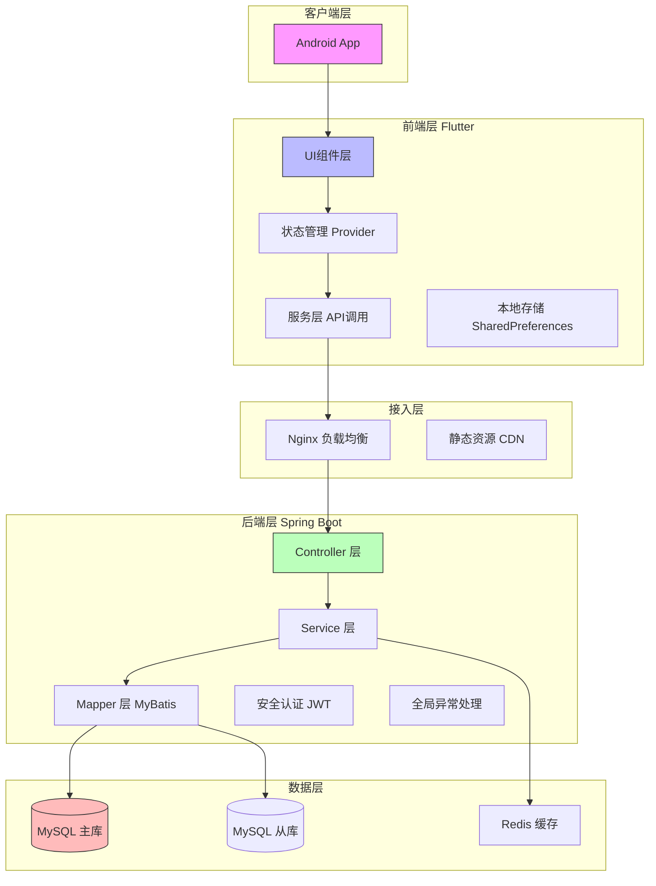
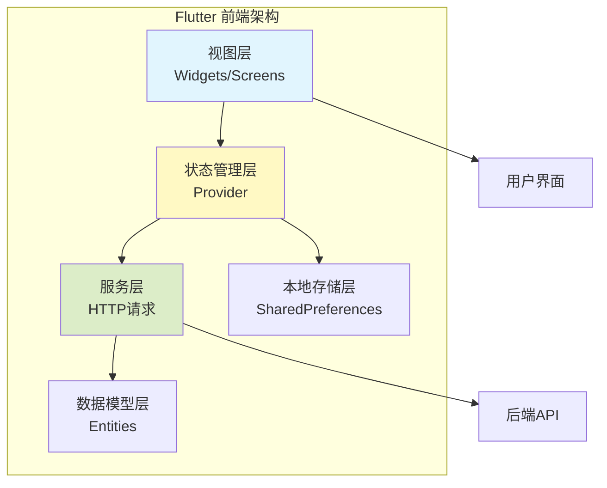
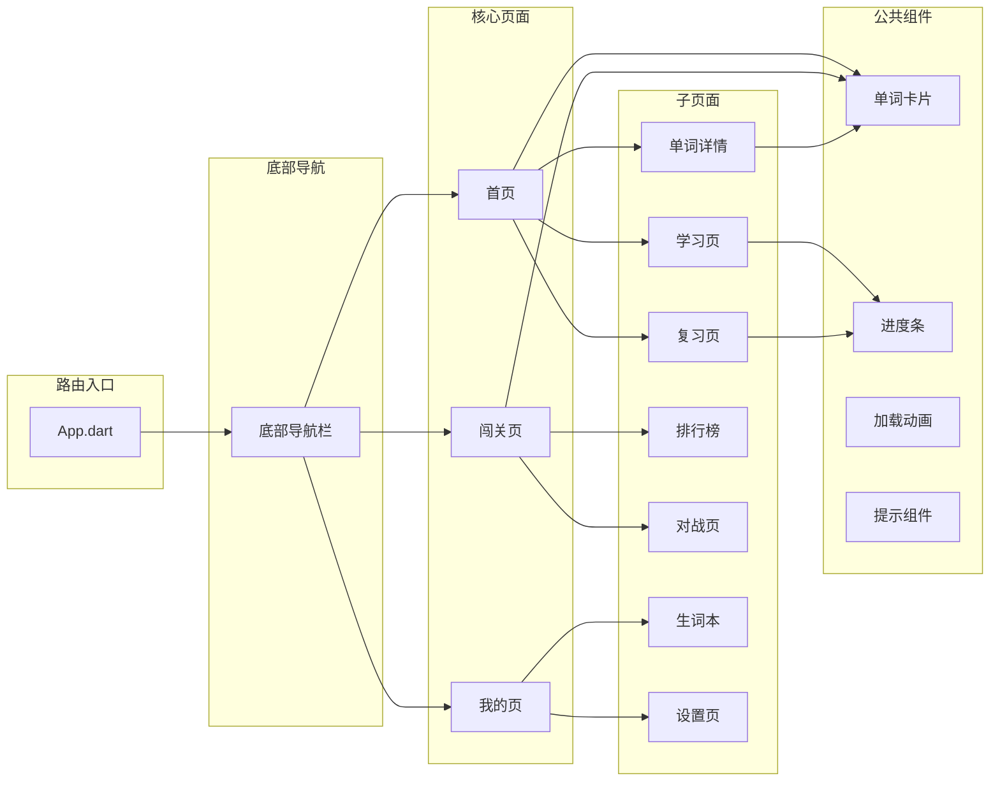
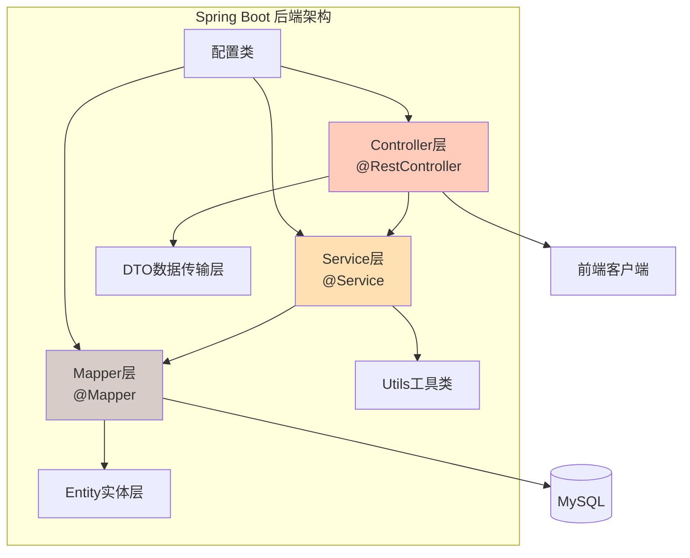
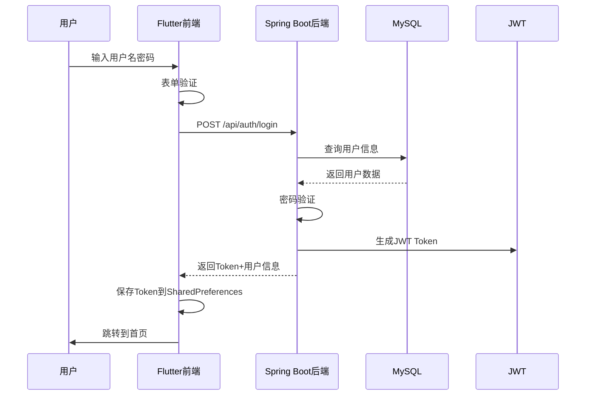
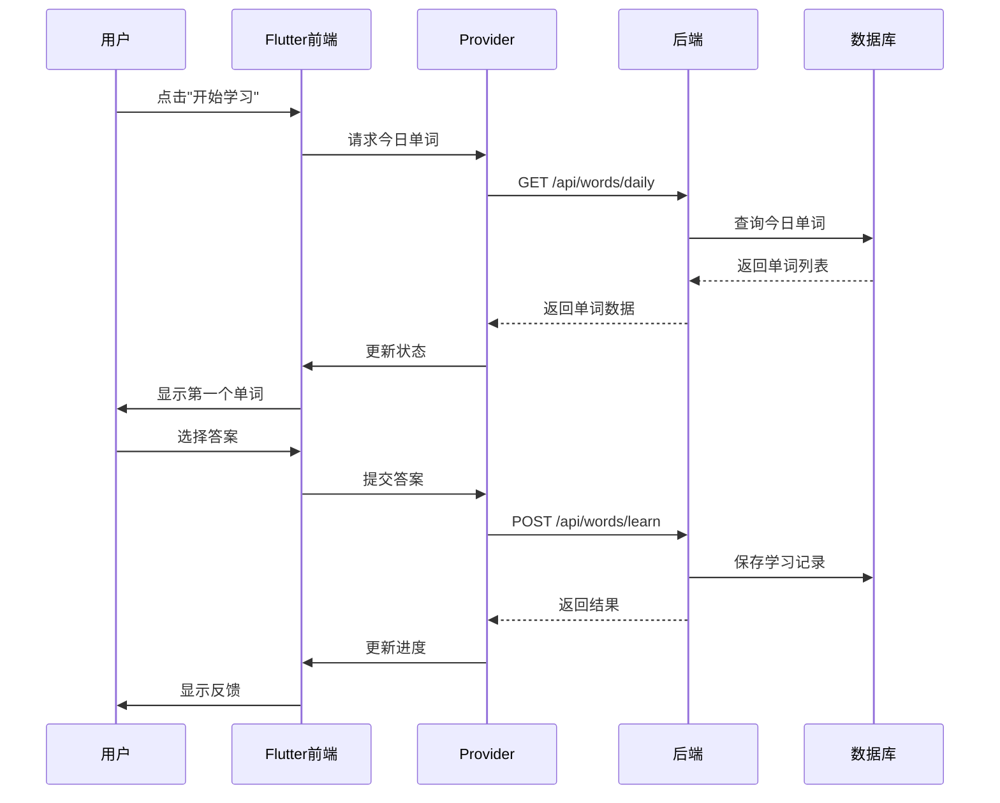
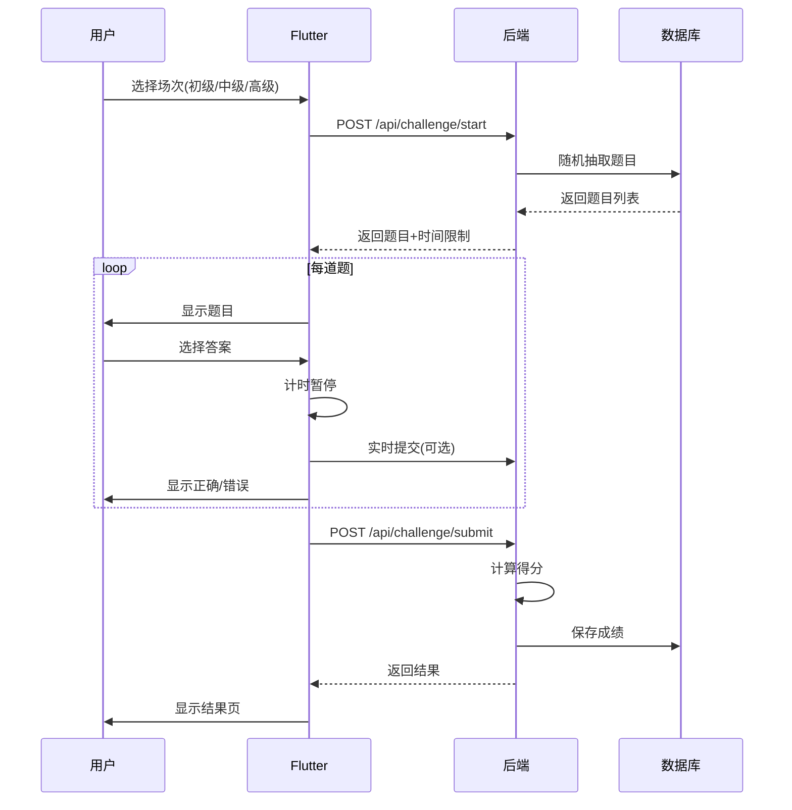
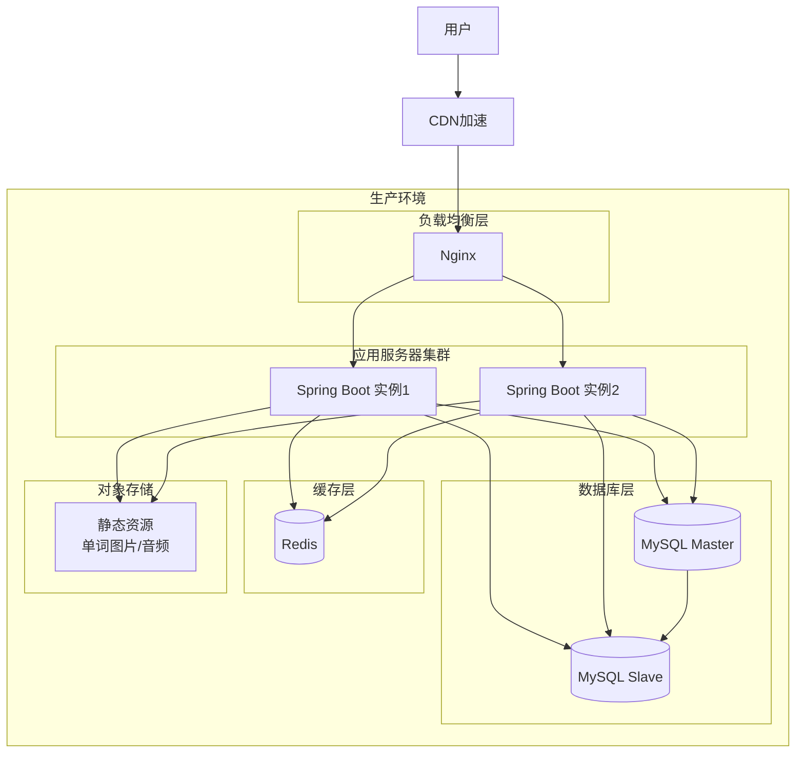

# 背了么 App - 软件架构设计文档

## 一、系统架构概览

背了么 App 采用 **前后端分离架构**，前端为 Flutter 跨平台应用，后端为 Spring Boot 微服务架构，数据层使用 MySQL 数据库。

### 架构图（Mermaid）

### 系统分层说明

**客户端层**：Android - 用户设备端运行环境  
**前端层**：Flutter + Dart - UI渲染、用户交互、状态管理  
**接入层**：Nginx - 反向代理、负载均衡、静态资源服务  
**后端层**：Spring Boot + Java 17 - 业务逻辑处理、API接口提供  
**数据层**：MySQL + Redis - 数据持久化、缓存加速

## 二、前端架构设计
### 2.1 前端整体架构（Mermaid）

### 2.2 页面/组件结构（Mermaid）

### 2.3 前端模块划分

**auth**：登录注册、Token管理 - LoginScreen, RegisterScreen  
**home**：首页概览、学习入口 - HomeScreen, StudyCard, ReviewCard  
**study**：标准背词模式 - StudyScreen, WordCard, ChoiceOptions  
**challenge**：分级闯关模式 - ChallengeScreen, BattleScreen, Timer  
**leaderboard**：排行榜展示 - LeaderboardScreen, RankItem  
**ai_wordbook**：AI词本 - WordbookScreen, AIDialog  
**profile**：个人中心、设置 - ProfileScreen, SettingsScreen  

## 三、后端架构设计
### 3.1 后端整体架构（Mermaid）

### 3.2 后端模块划分

**用户模块**：com.beileme.auth - 登录注册、JWT认证  
**单词模块**：com.beileme.word - 单词学习、复习  
**闯关模块**：com.beileme.challenge - 闯关对战、积分  
**排行榜模块**：com.beileme.leaderboard - 积分排名  
**AI词本模块**：com.beileme.ai - 生词本、AI例句  
**公共模块**：com.beileme.common - 工具类、常量  

### 3.3 核心接口设计

**POST /api/auth/login**：用户登录 - 参数：{username, password} → 返回：{token, userInfo}  
**POST /api/auth/register**：用户注册 - 参数：{username, password, email} → 返回：{userId, token}  
**GET /api/words/daily**：每日单词 - 参数：无 → 返回：List<Word>  
**POST /api/words/learn**：学习记录 - 参数：{wordId, isCorrect} → 返回：{nextWord, progress}  
**POST /api/challenge/start**：开始闯关 - 参数：{level} → 返回：{questions, timeLimit}  
**POST /api/challenge/submit**：提交答案 - 参数：{challengeId, answers} → 返回：{score, correctCount}  
**GET /api/leaderboard**：获取排行榜 - 参数：{type: daily/weekly/total} → 返回：List<RankItem>  
**POST /api/wordbook/add**：加入生词本 - 参数：{wordId} → 返回：{success, wordbookId}  
**GET /api/wordbook/ai**：获取AI例句 - 参数：{wordId} → 返回：{examples, dialogues}  

## 四、系统交互流程
### 4.1 用户登录流程（Mermaid）

### 4.2 单词学习流程（Mermaid）

### 4.3 闯关对战流程（Mermaid）

## 五、技术选型确认表

**前端框架**：Flutter 3.x - 一套代码多端运行(iOS/Android)，性能接近原生，热重载开发效率高  
**状态管理**：Provider - 官方推荐，简单易用，与Flutter结合紧密，学习成本低  
**网络请求**：http包 - 轻量级，足够满足项目需求，避免引入过多依赖  
**本地存储**：SharedPreferences - 适合存储简单配置和Token，使用简单  
**后端框架**：Spring Boot 2.7+ - Java生态最成熟框架，集成方便，社区活跃  
**ORM框架**：MyBatis - SQL可控，性能好，适合复杂查询  
**数据库**：MySQL 8.0 - 稳定可靠，开源免费，满足中小型应用需求  
**认证方式**：JWT - 无状态，适合分布式部署  
**部署方式**：Docker - 环境一致性，便于扩展和迁移  

## 六、安全架构

### 6.1 认证与授权

- **JWT拦截器**：除登录注册外所有接口都需要Token验证  
- **密码加密**：BCrypt加密存储  
- **接口限流**：防止暴力请求  

### 6.2 数据安全

- **SQL注入防护**：MyBatis参数化查询  
- **XSS防护**：输入过滤  
- **敏感信息脱敏**：返回数据不包含密码等敏感字段  

### 6.3 传输安全

- **HTTPS**：生产环境强制使用  
- **Token过期机制**：设置合理有效期  

## 七、部署架构（Mermaid）

