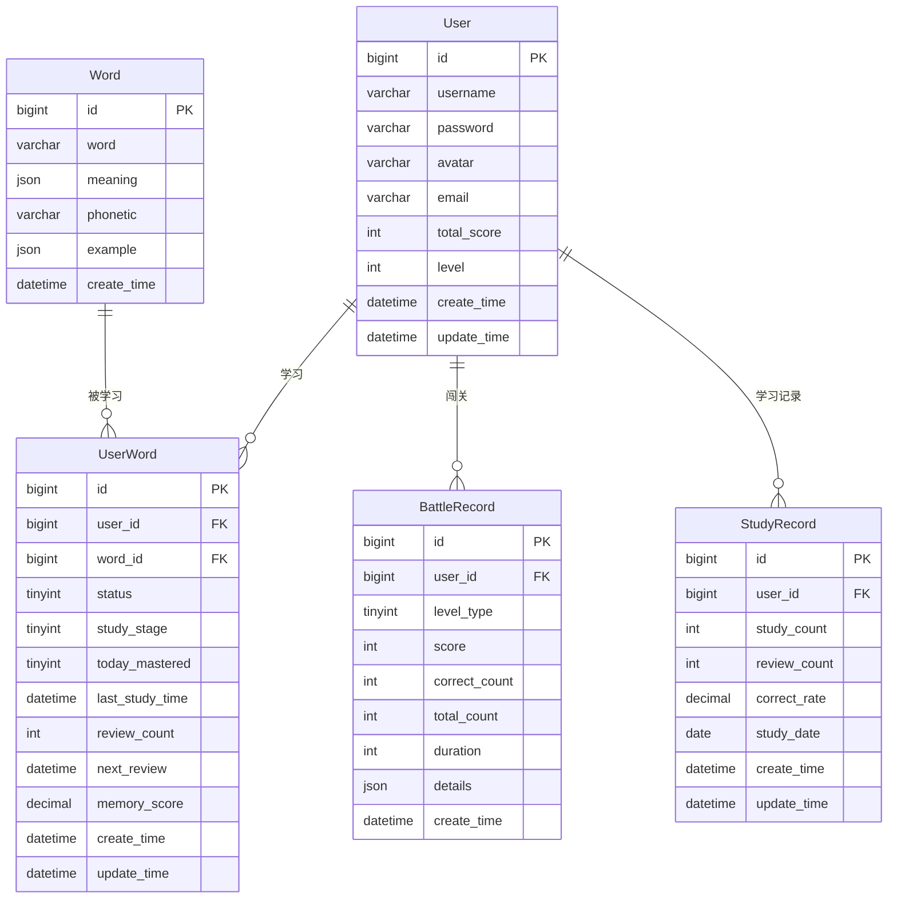

# 背了么 —— 数据库设计文档

**最后更新：** 2026-04-05  
**作者：** 陈子怡

---

## 一、设计原则（⭐必须遵守）

### 1.1 数据驱动原则
- 所有功能必须先设计数据库，再设计API
- 数据结构优先于业务逻辑
- 禁止绕过数据库直接实现业务

### 1.2 核心业务优先级
1. 单词学习系统（user_word）⭐核心
2. 复习机制（间隔重复）
3. 闯关系统（battle_record）
4. 排行榜系统（user.total_score）

### 1.3 设计规范
- 使用 InnoDB + utf8mb4
- 必须包含 create_time / update_time（word 表仅 create_time，无 update_time）
- 高查询字段必须建立索引
- JSON字段用于扩展能力
- 禁止冗余数据

---

## 二、数据库概览

| 项目 | 说明 |
|------|------|
| 数据库 | MySQL 8.0 |
| 名称 | beileme |
| 字符集 | utf8mb4 |
| 排序规则 | utf8mb4_general_ci |
| 引擎 | InnoDB |

### 2.1 创建数据库（与实际环境一致）

```sql
CREATE DATABASE IF NOT EXISTS beileme
    DEFAULT CHARACTER SET utf8mb4
    COLLATE utf8mb4_general_ci;

USE beileme;
```

---

## 三、ER关系图



---

## 四、核心表设计

> **说明：** `user_word` 在实际库中可先建基础表再通过 `ALTER TABLE` 追加 `study_stage`、`today_mastered`、`last_study_time`；下述 DDL 为**最终生效结构**（与线上一致）。`user.email` 同样由 `ALTER TABLE` 在 `avatar` 后追加。

### 4.1 用户表（user）

存储用户基本信息。

```sql
CREATE TABLE `user` (
    `id` BIGINT NOT NULL AUTO_INCREMENT COMMENT '主键ID',
    `username` VARCHAR(50) NOT NULL COMMENT '用户名（唯一）',
    `password` VARCHAR(255) NOT NULL COMMENT '加密密码（BCrypt）',
    `avatar` VARCHAR(255) DEFAULT NULL COMMENT '头像URL',
    `email` VARCHAR(100) DEFAULT NULL COMMENT '邮箱',
    `total_score` INT NOT NULL DEFAULT 0 COMMENT '总积分（排行榜）',
    `level` INT NOT NULL DEFAULT 1 COMMENT '用户等级',
    `create_time` DATETIME NOT NULL DEFAULT CURRENT_TIMESTAMP,
    `update_time` DATETIME NOT NULL DEFAULT CURRENT_TIMESTAMP ON UPDATE CURRENT_TIMESTAMP,
    PRIMARY KEY (`id`),
    UNIQUE KEY `uk_username` (`username`)
) ENGINE=InnoDB DEFAULT CHARSET=utf8mb4 COMMENT='用户表';
```

若从旧库升级，可执行：

```sql
ALTER TABLE `user` ADD COLUMN `email` VARCHAR(100) DEFAULT NULL COMMENT '邮箱' AFTER `avatar`;
```

---

### 4.2 单词表（word）

存储所有单词库。

```sql
CREATE TABLE `word` (
    `id` BIGINT NOT NULL AUTO_INCREMENT COMMENT '主键ID',
    `word` VARCHAR(100) NOT NULL COMMENT '单词',
    `meaning` JSON NOT NULL COMMENT '释义（JSON数组）',
    `phonetic` VARCHAR(50) DEFAULT NULL COMMENT '音标',
    `example` JSON DEFAULT NULL COMMENT '例句（JSON数组）',
    `create_time` DATETIME NOT NULL DEFAULT CURRENT_TIMESTAMP,
    PRIMARY KEY (`id`),
    UNIQUE KEY `uk_word` (`word`)
) ENGINE=InnoDB DEFAULT CHARSET=utf8mb4 COMMENT='单词表';
```

---

### 4.3 用户单词表（⭐核心表 user_word）

记录用户的学习进度、复习计划和生词本。

**基础建表（无外键可先建 user/word 后执行）：**

```sql
CREATE TABLE `user_word` (
    `id` BIGINT NOT NULL AUTO_INCREMENT COMMENT '主键ID',
    `user_id` BIGINT NOT NULL COMMENT '用户ID',
    `word_id` BIGINT NOT NULL COMMENT '单词ID',
    `status` TINYINT NOT NULL DEFAULT 0 COMMENT '状态：0学习中 1已掌握 2生词本',
    `review_count` INT NOT NULL DEFAULT 0 COMMENT '复习次数',
    `next_review` DATETIME DEFAULT NULL COMMENT '下次复习时间',
    `memory_score` DECIMAL(4,3) NOT NULL DEFAULT 0 COMMENT '记忆强度（0~1）',
    `create_time` DATETIME NOT NULL DEFAULT CURRENT_TIMESTAMP,
    `update_time` DATETIME NOT NULL DEFAULT CURRENT_TIMESTAMP ON UPDATE CURRENT_TIMESTAMP,
    PRIMARY KEY (`id`),
    UNIQUE KEY `uk_user_word` (`user_id`, `word_id`),
    KEY `idx_review` (`user_id`, `status`, `next_review`),
    CONSTRAINT `fk_uw_user`
        FOREIGN KEY (`user_id`) REFERENCES `user`(`id`) ON DELETE CASCADE,
    CONSTRAINT `fk_uw_word`
        FOREIGN KEY (`word_id`) REFERENCES `word`(`id`) ON DELETE CASCADE
) ENGINE=InnoDB DEFAULT CHARSET=utf8mb4 COMMENT='用户学习核心表';
```

**字段追加（与实际库迁移脚本一致）：**

```sql
ALTER TABLE user_word
ADD COLUMN `study_stage` TINYINT NOT NULL DEFAULT 1
COMMENT '学习阶段：1-选义阶段 2-选例阶段 3-认词阶段'
AFTER `status`;

ALTER TABLE user_word
ADD COLUMN `today_mastered` TINYINT NOT NULL DEFAULT 0
COMMENT '今日是否已掌握：0-未掌握 1-已掌握'
AFTER `study_stage`;

ALTER TABLE user_word
ADD COLUMN `last_study_time` DATETIME DEFAULT NULL
COMMENT '最后学习时间'
AFTER `today_mastered`;
```

追加后列顺序为：`status` → `study_stage` → `today_mastered` → `last_study_time` → `review_count` → …

---

### 4.4 闯关记录表（battle_record）

记录用户的闯关战绩。

```sql
CREATE TABLE `battle_record` (
    `id` BIGINT NOT NULL AUTO_INCREMENT COMMENT '主键ID',
    `user_id` BIGINT NOT NULL COMMENT '用户ID',
    `level_type` TINYINT NOT NULL COMMENT '关卡等级（1初级 2中级 3高级）',
    `score` INT NOT NULL DEFAULT 0,
    `correct_count` INT NOT NULL DEFAULT 0,
    `total_count` INT NOT NULL DEFAULT 0,
    `duration` INT DEFAULT NULL COMMENT '耗时（秒）',
    `details` JSON DEFAULT NULL COMMENT '答题详情（JSON）',
    `create_time` DATETIME NOT NULL DEFAULT CURRENT_TIMESTAMP,
    PRIMARY KEY (`id`),
    KEY `idx_user_level` (`user_id`, `level_type`),
    KEY `idx_time` (`create_time`),
    CONSTRAINT `fk_br_user`
        FOREIGN KEY (`user_id`) REFERENCES `user`(`id`) ON DELETE CASCADE
) ENGINE=InnoDB DEFAULT CHARSET=utf8mb4 COMMENT='闯关记录表';
```

---

### 4.5 学习记录表（study_record）

每日学习统计，用于数据分析和进度展示。

```sql
CREATE TABLE `study_record` (
    `id` BIGINT NOT NULL AUTO_INCREMENT COMMENT '主键ID',
    `user_id` BIGINT NOT NULL COMMENT '用户ID',
    `study_count` INT DEFAULT 0 COMMENT '新学单词数',
    `review_count` INT DEFAULT 0 COMMENT '复习次数',
    `correct_rate` DECIMAL(4,3) DEFAULT 0 COMMENT '正确率（0~1）',
    `study_date` DATE NOT NULL COMMENT '日期',
    `create_time` DATETIME NOT NULL DEFAULT CURRENT_TIMESTAMP,
    `update_time` DATETIME NOT NULL DEFAULT CURRENT_TIMESTAMP ON UPDATE CURRENT_TIMESTAMP,
    PRIMARY KEY (`id`),
    UNIQUE KEY `uk_user_date` (`user_id`, `study_date`),
    CONSTRAINT `fk_sr_user`
        FOREIGN KEY (`user_id`) REFERENCES `user`(`id`) ON DELETE CASCADE
) ENGINE=InnoDB DEFAULT CHARSET=utf8mb4 COMMENT='每日学习统计表';
```

---

## 五、核心业务支持说明（⭐关键）

### 5.1 单词学习系统
- `user_word.status` 控制学习状态（0-学习中 1-已掌握 2-生词本）
- `user_word.study_stage`：选义 / 选例 / 认词阶段
- `user_word.today_mastered`：当日是否已掌握（可用于今日任务判断）
- `user_word.last_study_time`：最近学习时间
- `review_count` + `next_review` 实现间隔重复复习机制

### 5.2 AI能力支持
- `word.example` 存储例句等（JSON格式）
- `user_word.memory_score` 记录记忆强度，支持智能推荐

### 5.3 排行榜系统
- 基于 `user.total_score` 进行全服排名
- 支持后期接入 Redis ZSet 实现高性能实时排行榜

### 5.4 闯关系统
- `battle_record` 记录每次闯关的详细战绩
- `duration` 记录耗时；`details` 存储答题详情

### 5.5 学习统计
- `study_record` 按日聚合用户学习数据
- `correct_rate` 为 `DECIMAL(4,3)`，与 `memory_score` 精度一致

---

## 六、核心查询示例

### 6.1 获取用户需要复习的单词列表
```sql
SELECT 
    w.id,
    w.word,
    w.meaning,
    w.phonetic,
    w.example,
    uw.review_count,
    uw.memory_score,
    uw.next_review
FROM user_word uw
JOIN word w ON uw.word_id = w.id
WHERE uw.user_id = ?
  AND uw.next_review <= NOW()
  AND uw.status = 0
ORDER BY uw.next_review ASC;
```

### 6.2 获取排行榜（前100名）
```sql
SELECT 
    username,
    total_score,
    RANK() OVER (ORDER BY total_score DESC) as ranking
FROM user
ORDER BY total_score DESC
LIMIT 100;
```

### 6.3 获取用户学习统计
```sql
SELECT 
    u.id,
    u.username,
    u.total_score,
    COUNT(DISTINCT uw.word_id) as total_words,
    COUNT(DISTINCT CASE WHEN uw.status = 1 THEN uw.word_id END) as mastered_words,
    COUNT(DISTINCT CASE WHEN uw.status = 2 THEN uw.word_id END) as wordbook_words,
    COUNT(DISTINCT CASE WHEN uw.next_review <= NOW() AND uw.status = 0 THEN uw.word_id END) as due_review_count
FROM user u
LEFT JOIN user_word uw ON u.id = uw.user_id
WHERE u.id = ?
GROUP BY u.id;
```

### 6.4 获取用户近7天学习趋势
```sql
SELECT 
    study_date,
    study_count,
    review_count,
    correct_rate
FROM study_record
WHERE user_id = ?
  AND study_date >= DATE_SUB(CURDATE(), INTERVAL 7 DAY)
ORDER BY study_date DESC;
```

---

## 七、数据量预估与索引策略

| 表名 | 预估数据量 | 索引策略 | 说明 |
|------|------------|----------|------|
| user | < 10万 | 主键 + `uk_username` | 用户量增长慢 |
| word | < 2万 | 主键 + `uk_word` | 词库固定 |
| user_word | < 1000万 | `uk_user_word` + `idx_review` | 核心大表 |
| battle_record | < 500万 | `idx_user_level` + `idx_time` | 写入频繁 |
| study_record | < 500万 | `uk_user_date` | 每用户每日一条 |

---

## 八、字段说明速查表

| 字段名 | 中文含义 | 所属表 |
|--------|----------|--------|
| id | 主键ID | 所有表 |
| username | 用户名 | user |
| password | 加密密码 | user |
| avatar | 头像URL | user |
| email | 邮箱 | user |
| total_score | 总积分（排行榜） | user |
| level | 用户等级 | user |
| word | 单词 | word |
| meaning | 释义（JSON） | word |
| phonetic | 音标 | word |
| example | 例句（JSON） | word |
| status | 学习状态（0学习中/1已掌握/2生词本） | user_word |
| study_stage | 学习阶段（1选义/2选例/3认词） | user_word |
| today_mastered | 今日是否已掌握（0/1） | user_word |
| last_study_time | 最后学习时间 | user_word |
| review_count | 复习次数 | user_word, study_record |
| next_review | 下次复习时间 | user_word |
| memory_score | 记忆强度（0~1，DECIMAL） | user_word |
| level_type | 关卡等级（1初级/2中级/3高级） | battle_record |
| score | 得分 | battle_record |
| correct_count | 答对数量 | battle_record |
| total_count | 总题数 | battle_record |
| duration | 耗时（秒） | battle_record |
| details | 答题详情（JSON） | battle_record |
| study_count | 新学单词数 | study_record |
| correct_rate | 正确率（0~1，DECIMAL） | study_record |
| study_date | 学习日期 | study_record |
| create_time | 创建时间 | 所有含该字段的表 |
| update_time | 更新时间 | user, user_word, study_record |

---

## 九、建表执行顺序

与实际脚本一致，建议顺序：

1. `CREATE DATABASE` + `USE beileme`
2. `user`（可先建表，再 `ALTER` 增加 `email`）
3. `word`
4. `user_word`（建表后执行三条 `ALTER` 增加学习相关字段）
5. `battle_record`
6. `study_record`

---

## 十、初始化数据示例（与实际测试数据一致）

```sql
INSERT INTO word (word, meaning, phonetic, example) VALUES
    ('abandon', '["v. 放弃", "n. 放任"]', '/əˈbændən/', '["He abandoned his plan."]'),
    ('ability', '["n. 能力"]', '/əˈbɪləti/', '["She has ability."]'),
    ('absent', '["adj. 缺席的"]', '/ˈæbsənt/', '["He was absent."]');

INSERT INTO user (username, password) VALUES
    ('test_user', '$2a$10$encrypted'),
    ('demo_user', '$2a$10$encrypted');
```

生产环境请将 `password` 替换为真实 BCrypt 哈希；可按需补全 `avatar`、`email`、`total_score`、`level` 等字段。

---

## 十一、扩展规划

| 阶段 | 规划内容 | 说明 |
|------|----------|------|
| 近期 | Redis缓存排行榜 | 使用ZSet提升排行榜性能 |
| 中期 | AI学习路径推荐 | 基于memory_score做个性化推荐 |
| 中期 | 错题本系统 | 记录用户常错的单词 |
| 远期 | 单词标签系统 | 按难度、词频等分类 |
| 远期 | 学习数据分析 | 用户行为分析、学习效果评估 |

---
