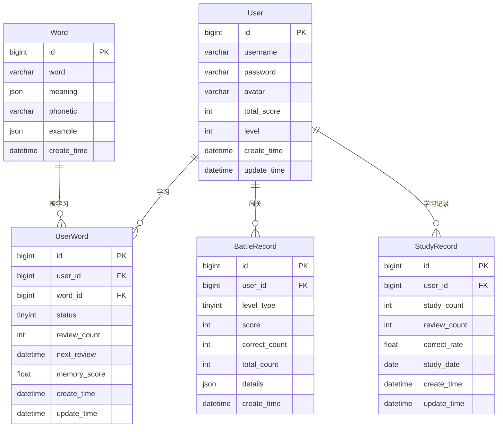

---

```markdown
# 背了么 —— 数据库设计文档

**最后更新：** 2026-03-18  
**作者：** 陈子怡

---

## 一、设计原则（⭐必须遵守）

### 1.1 数据驱动原则
- 所有功能必须先设计数据库，再设计API
- 数据结构优先于业务逻辑
- 禁止绕过数据库直接实现业务

### 1.2 核心业务优先级
1. 单词学习系统（user_word）⭐核心
2. 复习机制（间隔重复）
3. 闯关系统（battle_record）
4. 排行榜系统（user.total_score）

### 1.3 设计规范
- 使用 InnoDB + utf8mb4
- 必须包含 create_time / update_time
- 高查询字段必须建立索引
- JSON字段用于扩展能力
- 禁止冗余数据

---

## 二、数据库概览

| 项目 | 说明 |
|------|------|
| 数据库 | MySQL 8.0 |
| 名称 | beileme |
| 字符集 | utf8mb4 |
| 排序规则 | utf8mb4_general_ci |
| 引擎 | InnoDB |

---

## 三、ER关系图



---

## 四、核心表设计

### 4.1 用户表（user）

存储用户基本信息。

```sql
CREATE TABLE `user` (
    `id` BIGINT NOT NULL AUTO_INCREMENT COMMENT '主键ID',
    `username` VARCHAR(50) NOT NULL COMMENT '用户名（唯一）',
    `password` VARCHAR(255) NOT NULL COMMENT '加密密码（BCrypt）',
    `avatar` VARCHAR(255) DEFAULT NULL COMMENT '头像URL',
    `total_score` INT NOT NULL DEFAULT 0 COMMENT '总积分',
    `level` INT NOT NULL DEFAULT 1 COMMENT '用户等级',
    `create_time` DATETIME NOT NULL DEFAULT CURRENT_TIMESTAMP COMMENT '注册时间',
    `update_time` DATETIME NOT NULL DEFAULT CURRENT_TIMESTAMP ON UPDATE CURRENT_TIMESTAMP COMMENT '更新时间',
    PRIMARY KEY (`id`),
    UNIQUE KEY `idx_username` (`username`)
) ENGINE=InnoDB DEFAULT CHARSET=utf8mb4 COMMENT='用户表';
```

---

### 4.2 单词表（word）

存储所有单词库。

```sql
CREATE TABLE `word` (
    `id` BIGINT NOT NULL AUTO_INCREMENT COMMENT '主键ID',
    `word` VARCHAR(100) NOT NULL COMMENT '单词',
    `meaning` JSON NOT NULL COMMENT '释义（JSON数组格式）',
    `phonetic` VARCHAR(50) DEFAULT NULL COMMENT '音标',
    `example` JSON DEFAULT NULL COMMENT '例句（JSON数组格式）',
    `create_time` DATETIME NOT NULL DEFAULT CURRENT_TIMESTAMP COMMENT '创建时间',
    PRIMARY KEY (`id`),
    UNIQUE KEY `idx_word_unique` (`word`),
    KEY `idx_word` (`word`)
) ENGINE=InnoDB DEFAULT CHARSET=utf8mb4 COMMENT='单词表';
```

---

### 4.3 用户单词表（⭐核心表 user_word）

记录用户的学习进度、复习计划和生词本。

```sql
CREATE TABLE `user_word` (
    `id` BIGINT NOT NULL AUTO_INCREMENT COMMENT '主键ID',
    `user_id` BIGINT NOT NULL COMMENT '用户ID（关联user.id）',
    `word_id` BIGINT NOT NULL COMMENT '单词ID（关联word.id）',
    
    `status` TINYINT NOT NULL DEFAULT 0 COMMENT '学习状态：0-学习中 1-已掌握 2-生词本',
    `review_count` INT NOT NULL DEFAULT 0 COMMENT '复习次数',
    `next_review` DATETIME DEFAULT NULL COMMENT '下次复习时间（用于间隔重复）',
    
    `memory_score` FLOAT DEFAULT 0 COMMENT '记忆强度（0-1之间，用于AI推荐）',
    
    `create_time` DATETIME NOT NULL DEFAULT CURRENT_TIMESTAMP COMMENT '创建时间',
    `update_time` DATETIME NOT NULL DEFAULT CURRENT_TIMESTAMP ON UPDATE CURRENT_TIMESTAMP COMMENT '更新时间',

    PRIMARY KEY (`id`),
    UNIQUE KEY `idx_user_word` (`user_id`,`word_id`),
    KEY `idx_user_id` (`user_id`),
    KEY `idx_word_id` (`word_id`),
    KEY `idx_review` (`user_id`, status, `next_review`),

    CONSTRAINT `fk_user_word_user` FOREIGN KEY (`user_id`) REFERENCES `user`(`id`) ON DELETE CASCADE,
    CONSTRAINT `fk_user_word_word` FOREIGN KEY (`word_id`) REFERENCES `word`(`id`) ON DELETE CASCADE
) ENGINE=InnoDB DEFAULT CHARSET=utf8mb4 COMMENT='用户单词关系表（核心表）';
```

---

### 4.4 闯关记录表（battle_record）

记录用户的闯关战绩。

```sql
CREATE TABLE `battle_record` (
    `id` BIGINT NOT NULL AUTO_INCREMENT COMMENT '主键ID',
    `user_id` BIGINT NOT NULL COMMENT '用户ID（关联user.id）',
    
    `level_type` TINYINT NOT NULL COMMENT '关卡等级：1-初级 2-中级 3-高级',
    `score` INT NOT NULL DEFAULT 0 COMMENT '本局得分',
    `correct_count` INT NOT NULL DEFAULT 0 COMMENT '答对数量',
    `total_count` INT NOT NULL DEFAULT 0 COMMENT '总题数',
    `duration` INT COMMENT '本局耗时（秒）',
    `details` JSON DEFAULT NULL COMMENT '答题详情（每道题的对错、用时等）',
    
    `create_time` DATETIME NOT NULL DEFAULT CURRENT_TIMESTAMP COMMENT '闯关时间',

    PRIMARY KEY (`id`),
    KEY `idx_user_id` (`user_id`),
    KEY `idx_user_level` (`user_id`,`level_type`),
    KEY `idx_create_time` (`create_time`),

    CONSTRAINT `fk_battle_user` FOREIGN KEY (`user_id`) REFERENCES `user`(`id`) ON DELETE CASCADE
) ENGINE=InnoDB DEFAULT CHARSET=utf8mb4 COMMENT='闯关记录表';
```

---

### 4.5 学习记录表（study_record）

每日学习统计，用于数据分析和进度展示。

```sql
CREATE TABLE `study_record` (
    `id` BIGINT NOT NULL AUTO_INCREMENT COMMENT '主键ID',
    `user_id` BIGINT NOT NULL COMMENT '用户ID（关联user.id）',
    
    `study_count` INT DEFAULT 0 COMMENT '学习数量（新学单词数）',
    `review_count` INT DEFAULT 0 COMMENT '复习数量（复习单词数）',
    `correct_rate` FLOAT DEFAULT 0 COMMENT '正确率（0-1之间的数值）',
    
    `study_date` DATE NOT NULL COMMENT '学习日期（格式：YYYY-MM-DD）',

    `create_time` DATETIME NOT NULL DEFAULT CURRENT_TIMESTAMP COMMENT '创建时间',
    `update_time` DATETIME NOT NULL DEFAULT CURRENT_TIMESTAMP ON UPDATE CURRENT_TIMESTAMP COMMENT '更新时间',

    PRIMARY KEY (`id`),
    UNIQUE KEY `idx_user_date` (`user_id`,`study_date`),
    KEY `idx_user_id` (`user_id`),

    CONSTRAINT `fk_study_user` FOREIGN KEY (`user_id`) REFERENCES `user`(`id`) ON DELETE CASCADE
) ENGINE=InnoDB DEFAULT CHARSET=utf8mb4 COMMENT='学习统计表';
```

---

## 五、核心业务支持说明（⭐关键）

### 5.1 单词学习系统
- `user_word.status` 控制学习状态（0-学习中 1-已掌握 2-生词本）
- `review_count` + `next_review` 实现间隔重复复习机制
- 已掌握的单词不再进入复习队列

### 5.2 AI能力支持
- `word.example` 存储AI生成的例句和对话（JSON格式）
- `user_word.memory_score` 记录用户对单词的记忆强度，支持AI智能推荐

### 5.3 排行榜系统
- 基于 `user.total_score` 进行全服排名
- 支持后期接入 Redis ZSet 实现高性能实时排行榜

### 5.4 闯关系统
- `battle_record` 记录每次闯关的详细战绩
- `details` 字段存储每道题的对错、用时等数据，用于后续分析

### 5.5 学习统计
- `study_record` 按日聚合用户学习数据
- 用于个人学习报告、进度可视化

---

## 六、核心查询示例

### 6.1 获取用户需要复习的单词列表
```sql
SELECT 
    w.*,
    uw.review_count,
    uw.memory_score
FROM user_word uw
JOIN word w ON uw.word_id = w.id
WHERE uw.user_id = ?
  AND uw.next_review <= NOW()
  AND uw.status = 0
ORDER BY uw.next_review ASC;
```

### 6.2 获取排行榜（前100名）
```sql
SELECT 
    username,
    total_score,
    RANK() OVER (ORDER BY total_score DESC) as ranking
FROM user
ORDER BY total_score DESC
LIMIT 100;
```

### 6.3 获取用户学习统计
```sql
SELECT 
    u.id,
    u.username,
    u.total_score,
    COUNT(DISTINCT uw.word_id) as total_words,
    COUNT(DISTINCT CASE WHEN uw.status = 1 THEN uw.word_id END) as mastered_words,
    COUNT(DISTINCT CASE WHEN uw.status = 2 THEN uw.word_id END) as wordbook_words,
    COUNT(DISTINCT CASE WHEN uw.next_review <= NOW() AND uw.status = 0 THEN uw.word_id END) as due_review_count
FROM user u
LEFT JOIN user_word uw ON u.id = uw.user_id
WHERE u.id = ?
GROUP BY u.id;
```

### 6.4 获取用户近7天学习趋势
```sql
SELECT 
    study_date,
    study_count,
    review_count,
    correct_rate
FROM study_record
WHERE user_id = ?
  AND study_date >= DATE_SUB(CURDATE(), INTERVAL 7 DAY)
ORDER BY study_date DESC;
```

---

## 七、数据量预估与索引策略

| 表名 | 预估数据量 | 索引策略 | 说明 |
|------|------------|----------|------|
| user | < 10万 | 主键 + username唯一索引 | 用户量增长慢 |
| word | < 2万 | 主键 + word唯一索引 | 词库固定 |
| user_word | < 1000万 | 联合唯一索引 + user_id索引 + next_review索引 | 核心大表，需要优化查询 |
| battle_record | < 500万 | user_id索引 + user_level联合索引 + create_time索引 | 写入频繁，查询较少 |
| study_record | < 500万 | user_date唯一索引 | 每日一条，适合分析 |

---

## 八、字段说明速查表

| 字段名 | 中文含义 | 所属表 |
|--------|----------|--------|
| id | 主键ID | 所有表 |
| username | 用户名 | user |
| password | 加密密码 | user |
| avatar | 头像URL | user |
| total_score | 总积分 | user |
| level | 用户等级 | user |
| word | 单词 | word |
| meaning | 释义（JSON） | word |
| phonetic | 音标 | word |
| example | 例句（JSON） | word |
| status | 学习状态（0学习中/1已掌握/2生词本） | user_word |
| review_count | 复习次数 | user_word, study_record |
| next_review | 下次复习时间 | user_word |
| memory_score | 记忆强度（0-1） | user_word |
| level_type | 关卡等级（1初级/2中级/3高级） | battle_record |
| score | 得分 | battle_record |
| correct_count | 答对数量 | battle_record |
| total_count | 总题数 | battle_record |
| details | 答题详情（JSON） | battle_record |
| study_count | 学习数量（新词） | study_record |
| correct_rate | 正确率 | study_record |
| study_date | 学习日期 | study_record |
| create_time | 创建时间 | 所有表 |
| update_time | 更新时间 | 所有表 |

---

## 九、建表执行顺序

```sql
-- 1. 创建无依赖的基础表
source user.sql;
source word.sql;

-- 2. 创建有外键依赖的关联表
source user_word.sql;      -- 依赖 user, word
source battle_record.sql;   -- 依赖 user
source study_record.sql;    -- 依赖 user
```

---

## 十、初始化数据示例

```sql
-- 插入示例单词（用于测试）
INSERT INTO word (word, meaning, phonetic, example) VALUES
('abandon', '["v. 放弃", "n. 放任"]', '/əˈbændən/', '["He abandoned his plan.", "They abandoned the city."]'),
('ability', '["n. 能力", "才能"]', '/əˈbɪləti/', '["She has the ability to learn fast."]'),
('absent', '["adj. 缺席的", "心不在焉的"]', '/ˈæbsənt/', '["He was absent from school."]');

-- 插入测试用户（密码需加密，示例用明文）
INSERT INTO user (username, password, avatar, total_score, level) VALUES
('test_user', '$2a$10$加密后的密码', NULL, 1250, 3),
('demo_user', '$2a$10$加密后的密码', NULL, 800, 2);
```

---

## 十一、扩展规划

| 阶段 | 规划内容 | 说明 |
|------|----------|------|
| 近期 | Redis缓存排行榜 | 使用ZSet提升排行榜性能 |
| 中期 | AI学习路径推荐 | 基于memory_score做个性化推荐 |
| 中期 | 错题本系统 | 记录用户常错的单词 |
| 远期 | 单词标签系统 | 按难度、词频等分类 |
| 远期 | 学习数据分析 | 用户行为分析、学习效果评估 |

---