---

# 一、项目介绍 [张欣、陈子怡]

## 1.1 背景与问题陈述

大学生英语备考（四六级、考研等）需要长期积累词汇，但许多用户面临应用上手步骤多、缺少即时反馈难以坚持、复习计划不透明等问题，容易反复「下载—放弃—再开始」。

「背了么」面向在校大学生与多次重启背单词的用户，通过卡片式学习、闯关积分和全服排行榜，降低使用门槛，让用户清楚今天要学什么以及完成后的反馈，从而提升坚持使用的可能性。

## 1.2 项目目标与核心功能

- 功能性需求：用户注册登录；今日新词与复习；标准背词与四选一复习；分级闯关与积分；全服排行榜；生词本与 AI 联想展示；个人中心统计、趋势与日历；设置（含深色模式）。
- 非功能性需求（性能、可用性、安全性等）：个人中心分块加载；HTTPS 部署；JWT 鉴权；BCrypt 密码；CORS 白名单；日志脱敏；前后端 CI 与单元测试。

用户完成注册或登录后进入首页，可进入标准背词或复习，也可闯关获取积分并查看排行榜，可将单词加入生词本并查看 AI 内容，在个人中心查看学习数据。本文档仅描述当前已实现并可演示的功能。

## 1.3 技术选型

前端采用 Flutter 3.x + Dart，一套代码支持 Web/Android，UI 与业务分层清晰；状态管理使用 Provider，路由使用 go_router，网络使用 http，本地存储使用 SharedPreferences。后端采用 Spring Boot 3.x + Java 17，分层为 Controller → Service → Mapper。数据库采用 MySQL 8.0 + MyBatis，便于排行榜与学习状态等复杂 SQL。认证采用 JWT。AI 通过后端调用火山引擎 Ark SDK，密钥不暴露给客户端。部署采用 Docker + Railway，衔接课程 Docker 与云服务作业。

## 1.4 团队分工

| 姓名 | 学号 | 角色 | 主要负责 |
|------|------|------|----------|
| 张欣 | 2312190333 | 前端 | Flutter 页面与组件；路由、主题、Provider；ApiClient 与联调；单词详情 AI 展示；前端 Docker/Nginx；前端 CI、测试与安全；云服务与监控（前端部分） |
| 陈子怡 | 2312190329 | 后端 | 数据库与 init.sql；Spring Boot 业务 API；JWT、MyBatis；AI 服务与 Prompt 净化；后端 Docker；Railway 部署；监控（日志、指标、健康检查） |

贡献记录按课程任务拆分保存在 `docs/contributions/`：张欣主要记录在 `05-frontend`、`07-ai`、`08-testing`、`09-cicd`、`11-docker` 等目录；陈子怡主要记录在 `06-backend`、`07-ai`、`08-testing`、`10-security`、`12-cloud`、`13-monitoring` 等目录。

# 二、版本控制与团队协作 [张欣、陈子怡]

## 2.1 分支策略

采用 GitHub Flow 变体：master 为生产发布分支，Railway 自动部署监听 master；develop 为集成分支；feature/* 为个人功能分支（如 feature/zhangxin-profile）。合并需通过 Pull Request，且 CI 通过后方可合入。

## 2.2 提交规范

Commit 前缀：feat（新功能）、fix（修复）、docs（文档）、test（测试）、chore（构建与工具）。PR 流程：创建 PR → CodeRabbit 或同伴 Review → CI 绿 → 合并。规范详见仓库 CLAUDE.md。

## 2.3 协作统计

- 各成员提交次数：仓库累计提交以 `ziyichen`（63）、`ant1214`（60）、`Xin Zhang`（47）、`zhangxin`（29）等账号为主（Git 用户名与成员姓名不一致，如 `ant1214` 对应陈子怡、`zhangxin` / `Xin Zhang` 对应张欣）。

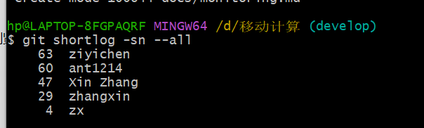

为进一步说明个人提交记录，团队分别截取了两位成员的 `git log --stat --all` 输出。

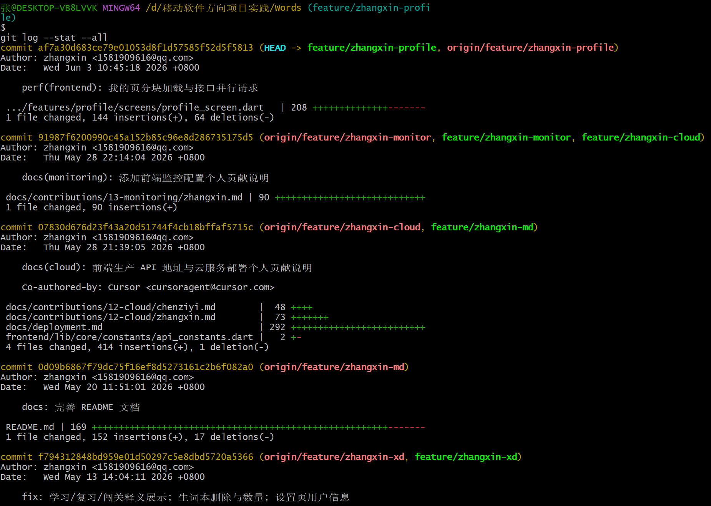

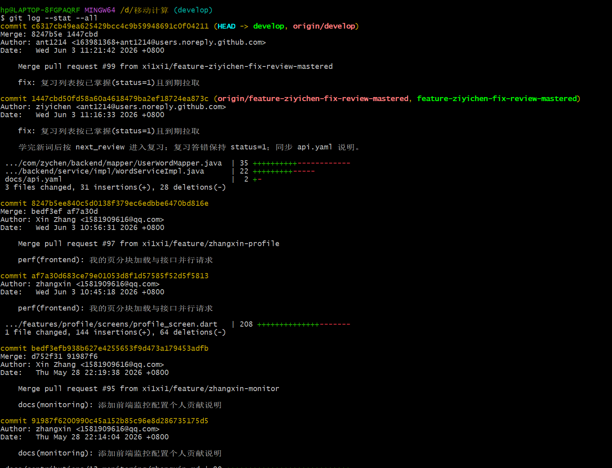

- 关键 PR：通过 GitHub Pull Request 合并功能，代表性 PR 包括 #88（生产环境改用 Railway HTTPS 后端）、#90（日志监控与健康检查）、#92（Railway 日志目录修复）等；合并前经 CI 检查。

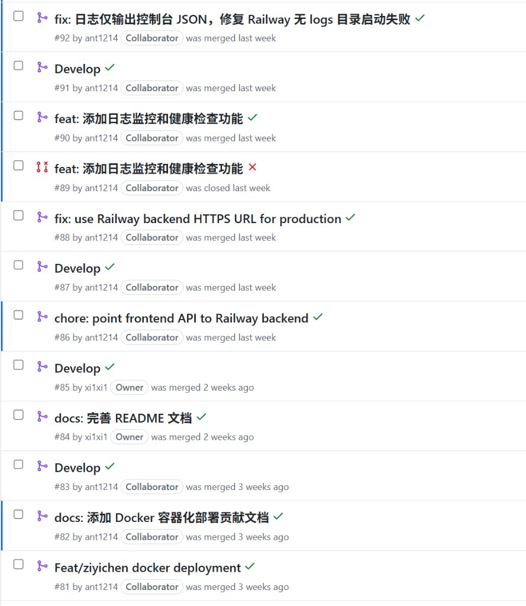

- 使用的项目管理工具：GitHub Pull Requests；个人说明见 docs/contributions/

# 三、UI/UX 设计与原型 [张欣]

## 3.1 用户画像与场景分析

目标用户为 18–25 岁大学生，备考四六级或考研。典型场景：早晨约 10 分钟完成今日新词；排队时用 5 分钟复习；晚间通过闯关获取积分；遇到难词加入生词本并查看 AI 联想。本系统无教师端，仅普通用户角色。

## 3.2 界面原型设计

界面原型按业务模块组织为认证模块、学习模块、闯关模块和个人中心模块。底部三 Tab：首页、闯关、我的。这样设计的原因是背单词应用的高频入口主要集中在“今日学习”“闯关激励”和“个人统计”三类任务，三 Tab 能减少用户查找功能的成本；未登录访问业务页时统一重定向至登录或注册，避免每个页面重复处理鉴权逻辑。

### 3.2.1 认证模块

认证模块包含登录与注册页面，负责用户进入系统前的身份确认。设计上采用居中的表单卡片和明确的主按钮，减少移动端输入干扰；登录成功后进入首页，注册完成后也进入首页，降低新用户首次使用门槛。

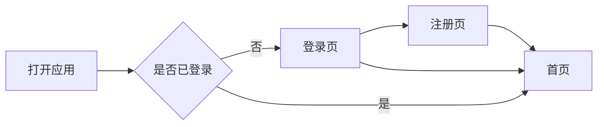
```mermaid
flowchart LR
    Start[打开应用] --> AuthCheck{是否已登录}
    AuthCheck -- 否 --> Login[登录页]
    Login --> Register[注册页]
    Register --> Home[首页]
    Login --> Home
    AuthCheck -- 是 --> Home
```

该模块的优点是流程短、状态清晰，便于和后端 JWT 登录接口配合；缺点是当前只支持用户名密码登录，缺少第三方登录方式。实现难点主要在于表单校验、防重复提交、Token 持久化以及登录态失效后的自动跳转。

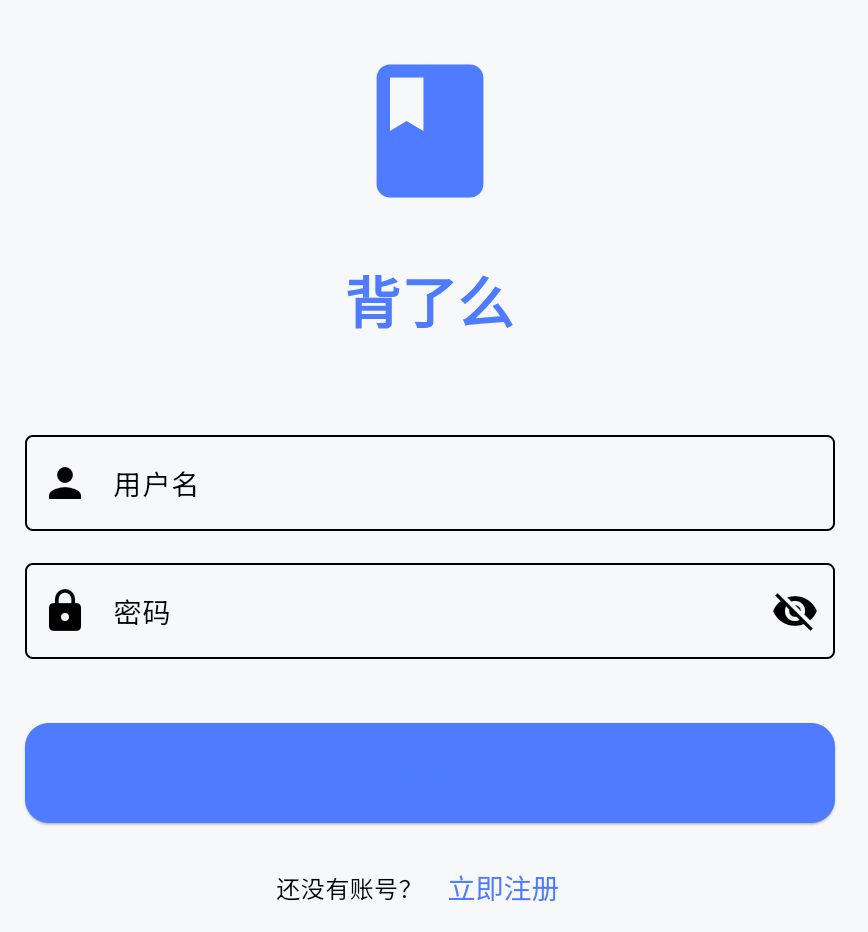

### 3.2.2 学习模块

学习模块以首页为入口，首页展示今日新词、复习任务和快速开始按钮。学习页负责标准背词与复习，单词详情页展示释义、例句、生词本状态和 AI 联想记忆内容。

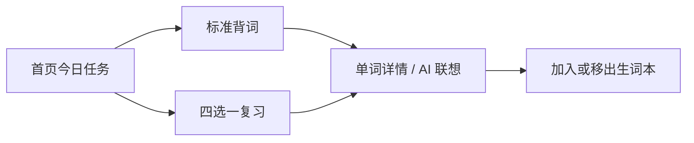
```mermaid
flowchart LR
    Home[首页今日任务] --> Study[标准背词]
    Home --> Review[四选一复习]
    Study --> WordDetail[单词详情 / AI 联想]
    Review --> WordDetail
    WordDetail --> WordbookAction[加入或移出生词本]
```

这样设计的原因是学习任务具有明显的日常性，首页直接给出今日任务能减少用户决策成本；单词详情与 AI 联想放在二级页面，避免学习主流程信息过载。优点是主流程线性、适合碎片化学习；缺点是复杂解释内容需要跳转详情页查看。实现难点在于每日单词、复习单词、生词状态和 AI 内容来自不同接口，需要前端做好 loading、错误提示和局部刷新。

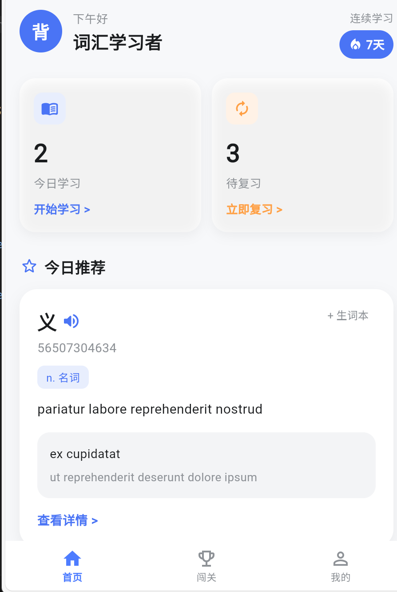

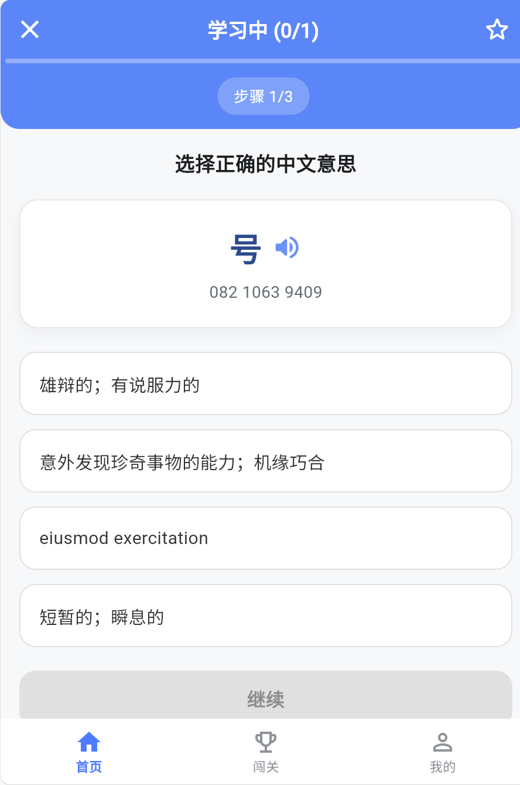

### 3.2.3 闯关模块

闯关模块包含选择关卡、答题、结果和排行榜入口，用积分和排名提供即时反馈。用户从闯关 Tab 进入选关页，完成答题后进入结果页，再根据得分查看排行榜。


```mermaid
flowchart LR
    ChallengeTab[闯关 Tab] --> ChallengeSelect[选择关卡]
    ChallengeSelect --> ChallengeQuiz[闯关答题]
    ChallengeQuiz --> ChallengeResult[闯关结果]
    ChallengeResult --> Leaderboard[排行榜]
```

该设计的原因是闯关与日常背词相比更强调反馈和激励，因此单独作为底部 Tab，避免隐藏太深。优点是路径明确、得分反馈强；缺点是答题页需要处理倒计时和答案状态，交互复杂度高于普通学习页。实现难点主要是防重复提交、计时状态管理、结果页数据与后端结算保持一致。

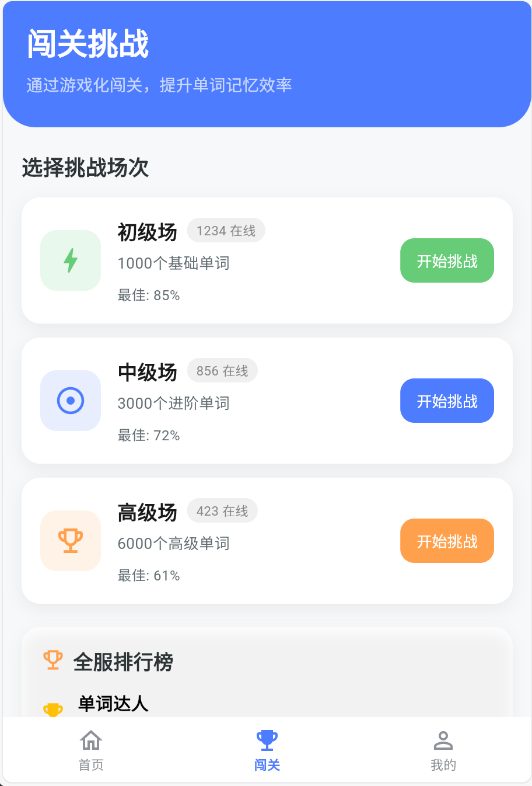

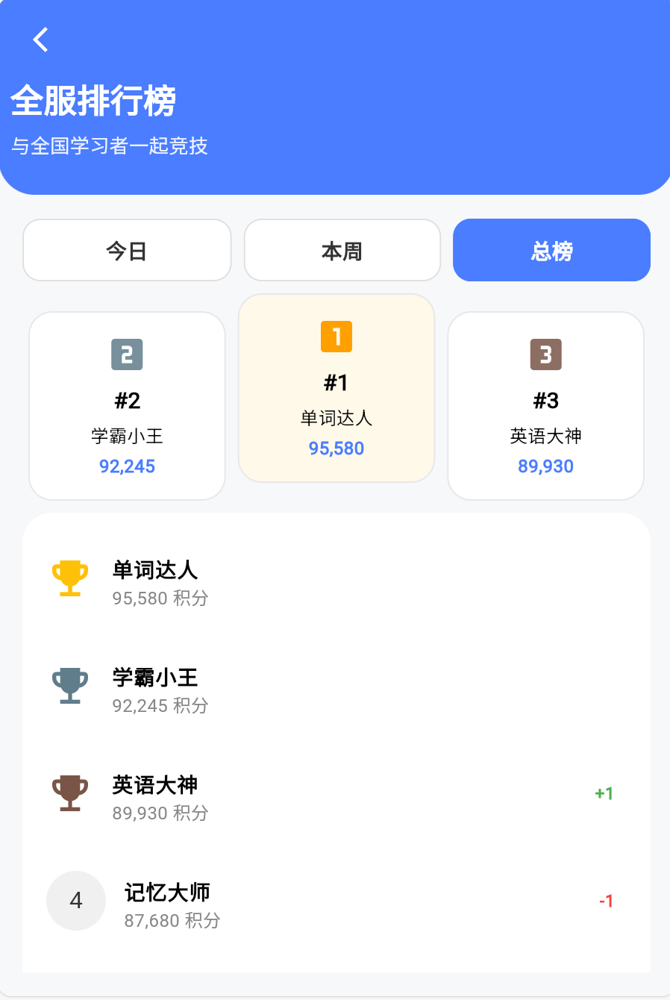

### 3.2.4 个人中心模块

个人中心模块包含学习统计、趋势日历、生词本和设置。用户在“我的”页查看长期学习结果，也可以进入生词本复习难词，或进入设置切换主题。

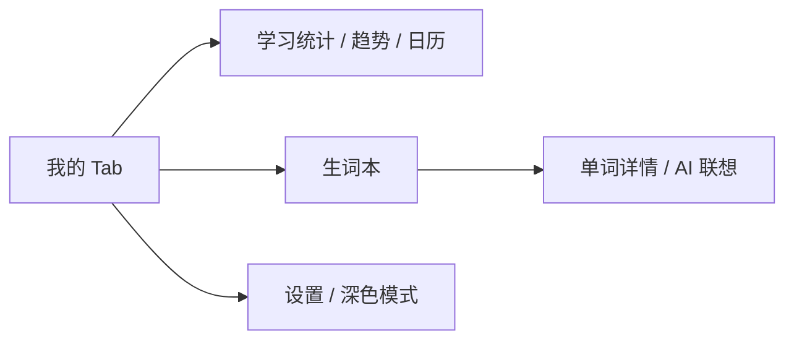
```mermaid
flowchart LR
    ProfileTab[我的 Tab] --> Stats[学习统计 / 趋势 / 日历]
    ProfileTab --> Wordbook[生词本]
    Wordbook --> WordDetail[单词详情 / AI 联想]
    ProfileTab --> Settings[设置 / 深色模式]
```

这样设计的原因是统计、生词和设置都属于低频但重要的管理功能，放在个人中心可以避免干扰首页学习主任务。优点是信息归类清晰，便于展示长期学习成果；缺点是个人中心聚合接口较多，如果串行加载会影响体验。实现难点集中在多接口并行、分块 loading、缓存生词本数量和深色模式状态持久化。

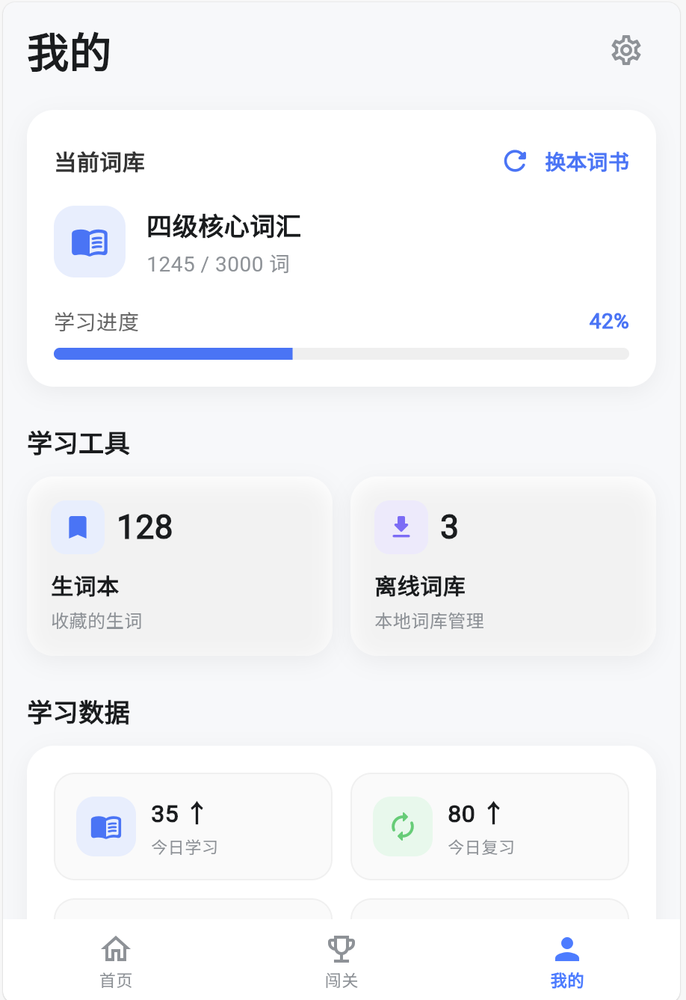

配色与字体：主色 #4F7CFF，支持浅色与深色模式，详见 docs/design-spec.md。整体设计优点是任务入口清晰、流程线性、适合移动端单手操作；缺点是 Flutter Web 首包较大，部分页面首次打开需要等待资源加载；实现难度中等，需与后端 API、登录态和缓存策略紧密联调。

### 3.2.5 交互设计原则

底部固定三 Tab 符合单手操作；go_router 统一鉴权与跳转；支持下拉刷新个人数据；学习流程步骤线性，减少多余页面切换。

### 3.2.6 用户体验设计

登录注册增强校验与防重复提交；错误提示不暴露后端内部细节；「我的」页分块加载，统计先展示、趋势与日历并行请求；深色模式保证对比度与可读性。

# 四、软件架构设计 [陈子怡]

## 4.1 整体架构

系统采用前后端分离：浏览器运行 Flutter Web，通过 HTTPS 调用 Spring Boot REST API；前端静态资源由 Nginx 托管；业务数据持久化在 MySQL。数据流：用户操作界面 → Service → ApiClient → Controller → Service → Mapper → MySQL → JSON 返回渲染。

整体架构如下：

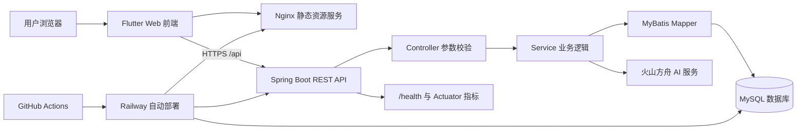
```mermaid
flowchart LR
    User[用户浏览器] --> Frontend[Flutter Web 前端]
    Frontend --> Nginx[Nginx 静态资源服务]
    Frontend -->|HTTPS /api| Backend[Spring Boot REST API]
    Backend --> Controller[Controller 参数校验]
    Controller --> Service[Service 业务逻辑]
    Service --> Mapper[MyBatis Mapper]
    Mapper --> MySQL[(MySQL 数据库)]
    Service --> Ark[火山方舟 AI 服务]
    Backend --> Health["/health 与 Actuator 指标"]
    GitHub[GitHub Actions] --> Railway[Railway 自动部署]
    Railway --> Nginx
    Railway --> Backend
    Railway --> MySQL
```

前端负责页面渲染、路由控制、Token 保存与接口调用；后端负责身份认证、学习状态更新、闯关计分、排行榜统计、生词本和 AI 联想封装；MySQL 保存用户、单词、学习记录、闯关记录等核心数据。AI 相关请求不由前端直接访问第三方平台，而是经过后端服务代理，避免密钥暴露。

优点：职责清晰、可独立部署。缺点：依赖网络；Flutter Web 首包较大。生产环境：Frontend（Nginx）与 Backend（JAR）部署于 Railway，MySQL 为 Railway 插件。

## 4.2 技术架构分层

### 4.2.1 表现层（前端）

features/ 按业务划分页面（auth、home、study、challenge、profile、wordbook、leaderboard 等）；widgets/ 为 WordCard、CustomButton 等复用组件；core/ 为主题、ApiClient、Provider；services/ 封装 REST；models/ 为数据结构。数据流：Widget → Provider（可选）→ Service → ApiClient → 后端。

### 4.2.2 业务逻辑层（后端）

Controller 接收 HTTP 与参数校验；Service 实现学习、闯关、排行榜、生词本、AI 等逻辑；Config 含 JWT 拦截器、CORS、RequestMetricsFilter；Common 含全局异常处理。

### 4.2.3 数据访问层

MyBatis Mapper 与 XML 映射 SQL；核心表 user_word 记录学习状态与复习计划；生产环境通过 Railway Variables 配置数据源与 MyBatis 驼峰映射、XML 扫描路径。当前版本的数据持久化与查询均基于 MySQL。

## 4.3 关键设计决策

REST + JSON：前后端分离标准方案，Flutter http 易集成。MyBatis 而非 JPA：排行榜与统计 SQL 需精细控制。JWT 而非 Session：无状态，适合 Web。AI 后端代理火山方舟：密钥不下发。Nginx 托管 Web：与 flutter build web 产物匹配。

# 五、API 设计 [张欣、陈子怡]

## 5.1 设计原则

RESTful 风格，统一前缀 /api；响应格式 { code, message, data }；除注册登录外携带 Authorization: Bearer token；错误码 400/401/403/500。完整说明见 docs/api.md，OpenAPI 见 docs/api.yaml。

## 5.2 接口文档

### 5.2.1 用户认证接口

用户认证模块负责注册、登录、登出和登录态建立。注册时后端校验用户名、密码等字段，密码使用 BCrypt 加密后保存；登录成功后返回 JWT 和基础用户信息，前端将 Token 保存到本地并在后续请求中通过 `Authorization: Bearer token` 发送。登出接口用于清理客户端登录态，服务端保持无状态设计。

| 方法 | 路径 | 是否鉴权 | 主要参数 | 说明 |
|------|------|----------|----------|------|
| POST | `/api/auth/register` | 否 | username、password | 创建新用户，密码加密保存 |
| POST | `/api/auth/login` | 否 | username、password | 校验账号密码，返回 JWT 和用户信息 |
| POST | `/api/auth/logout` | 是 | Authorization Header | 前端清除 Token，结束当前登录态 |

### 5.2.2 单词与学习接口

单词与学习模块围绕“今日任务”展开。前端进入首页或学习页时调用每日单词接口，后端根据用户已有学习记录、复习状态和单词库返回新词与复习词。用户完成一次学习或选择题后，前端提交学习结果，后端更新 `user_word` 中的掌握状态、复习计划和学习统计。搜索与详情接口用于支持单词查询、生词本详情页和 AI 联想入口。

| 方法 | 路径 | 是否鉴权 | 主要参数 | 说明 |
|------|------|----------|----------|------|
| GET | `/api/words/daily` | 是 | Authorization Header | 获取今日新词与待复习单词 |
| POST | `/api/words/learn` | 是 | wordId、isCorrect | 提交学习结果并更新学习状态 |
| GET | `/api/words/search` | 是 | keyword | 根据关键词搜索单词 |
| GET | `/api/words/{id}` | 是 | wordId | 获取单词释义、音标和详情信息 |

### 5.2.3 闯关与排行接口

闯关模块用于提高背词的反馈感和趣味性。用户开始闯关时，后端生成本轮题目和挑战标识；用户答题结束后提交答案列表，后端根据正确率、耗时等信息计算分数，并写入闯关记录和用户总积分。排行榜接口根据用户积分排序，前端在排行榜页展示全服排名。

| 方法 | 路径 | 是否鉴权 | 主要参数 | 说明 |
|------|------|----------|----------|------|
| POST | `/api/challenge/start` | 是 | level / mode | 开始闯关，返回题目列表和 challengeId |
| POST | `/api/challenge/submit` | 是 | challengeId、answers | 提交答题结果，返回得分、正确率和累计积分 |
| GET | `/api/challenge/records` | 是 | Authorization Header | 获取当前用户历史闯关记录 |
| GET | `/api/leaderboard` | 是 | page / size | 获取积分排行榜 |

### 5.2.4 数据统计、用户与生词本接口

数据统计模块服务于“我的”页面。前端进入个人中心后分块请求个人资料、学习统计、趋势和日历，避免所有数据串行加载导致整页等待。生词本接口用于添加、移除和查看难词，AI 联想接口通过后端调用火山方舟模型生成结构化记忆内容。用户接口支持资料展示和密码修改。

| 方法 | 路径 | 是否鉴权 | 主要参数 | 说明 |
|------|------|----------|----------|------|
| GET | `/api/study/stats` | 是 | Authorization Header | 获取累计学习天数、单词数、积分等统计 |
| GET | `/api/study/trend` | 是 | range | 获取学习趋势数据 |
| GET | `/api/study/calendar` | 是 | month | 获取学习日历数据 |
| GET | `/api/wordbook/list` | 是 | page / size | 获取生词本列表 |
| POST | `/api/wordbook/add/{wordId}` | 是 | wordId | 添加单词到生词本 |
| DELETE | `/api/wordbook/remove/{wordId}` | 是 | wordId | 从生词本移除单词 |
| GET | `/api/wordbook/ai/{wordId}` | 是 | wordId | 获取 AI 联想记忆内容 |
| GET / PUT | `/api/user/profile` | 是 | 用户资料字段 | 获取或修改个人资料 |
| PUT | `/api/user/password` | 是 | oldPassword、newPassword | 修改登录密码 |

### 5.2.5 请求与返回示例

所有接口均返回统一结构，下面列出实际联调中最核心的请求与响应示例；完整字段见 `docs/api.md` 与 `docs/api.yaml`。

**登录**

```http
POST /api/auth/login
Content-Type: application/json

{"username":"zhangsan","password":"Testpass1"}
```

```json
{
  "code": 200,
  "message": "success",
  "data": {
    "token": "<JWT_TOKEN>",
    "userInfo": {
      "id": 1001,
      "username": "zhangsan",
      "avatar": null,
      "totalScore": 0,
      "level": 1
    }
  }
}
```

**今日单词**

```http
GET /api/words/daily
Authorization: Bearer <token>
```

```json
{
  "code": 200,
  "message": "success",
  "data": {
    "newWords": [{"id": 1, "word": "abandon", "meaning": ["v. 放弃"], "phonetic": "/əˈbændən/"}],
    "reviewWords": []
  }
}
```

**提交学习结果**

```http
POST /api/words/learn
Authorization: Bearer <token>
Content-Type: application/json

{"wordId":1,"isCorrect":true}
```

```json
{"code":200,"message":"success","data":null}
```

**闯关提交**

```http
POST /api/challenge/submit
Authorization: Bearer <token>
Content-Type: application/json

{"challengeId":"ch_1701234567890","answers":[{"questionId":1,"selectedIndex":0,"timeSpent":8}]}
```

```json
{
  "code": 200,
  "message": "success",
  "data": {"score": 850, "correctCount": 1, "totalCount": 1, "accuracy": 1.0, "addedScore": 85, "totalScore": 1335}
}
```

**AI 联想记忆**

```http
GET /api/wordbook/ai/1
Authorization: Bearer <token>
```

```json
{
  "code": 200,
  "message": "success",
  "data": {
    "word": "abandon",
    "meaning": "放弃",
    "homophonic": {"title": "谐音联想", "content": "...", "explanation": "..."},
    "summary": "..."
  }
}
```

## 5.3 接口安全设计

JwtInterceptor 校验 Token；密码 BCrypt；AI 输入 PromptInputSanitizer 过滤；前端 ApiClient 自动附加 Token，401 清除登录态；生产 CORS 限制为前端 HTTPS Origin。

## 5.4 接口测试

后端 Controller 单元测试；前端 Service 层 mock HTTP 测试；CI 在 push/PR 时自动执行。详见 frontend/test/ 与 backend/src/test/。

> 本章接口分类、表格和流程说明由 AI 辅助整理，经团队成员对照 `docs/api.md`、`docs/api.yaml` 和实际前后端代码人工核对修改。

# 六、前端实现 [张欣]

## 6.1 技术栈与开发环境

Flutter 3.x / Dart SDK ^3.9.2；依赖 provider、go_router、http、shared_preferences。入口 lib/main.dart、lib/app.dart。本地运行：cd frontend && flutter pub get && flutter run。API 基址在 lib/core/constants/api_constants.dart。

## 6.2 核心功能模块实现

### 6.2.1 用户管理模块

login_screen.dart、register_screen.dart 实现表单校验与 loading 防重复提交；UserProvider 维护登录态，Token 存 SharedPreferences；go_router redirect 未登录跳转 /login。优点：实现简单、与后端 JWT 配合清晰；缺点：Web 端 SharedPreferences 安全性低于原生 Keychain。


### 6.2.2 分级闯关模块

对应本项目分级闯关：challenge_select_screen 选关 → challenge_game_screen 限时答题 → challenge_result_screen 展示得分 → recent_battles_screen 历史。ChallengeService 调用 /api/challenge/start 与 submit。流程：选难度 → 答题计时 → 提交 → 更新积分。

闯关模块采用“页面拆分 + Service 封装”的方式实现。选关、答题、结果和历史记录分别由独立页面负责，接口调用统一放在 `ChallengeService` 中，页面层不直接拼接 HTTP 请求，便于维护和测试。

闯关流程如下：


```mermaid
flowchart LR
    Select[选择关卡] --> Start[调用 startChallenge]
    Start --> Quiz[展示题目并计时]
    Quiz --> Answer[记录用户答案]
    Answer --> Submit[调用 submitChallenge]
    Submit --> Result[展示得分 / 正确率 / 积分变化]
    Result --> History[查看历史闯关记录]
```

该设计的优点是流程清晰、页面职责单一；缺点是页面之间需要传递 `challengeId`、题目列表和答案状态。实现难点主要是答题计时、防重复提交以及前端展示结果与后端结算结果保持一致。项目中通过 loading 状态、提交按钮禁用和后端统一结算分数来保证结果可信。


### 6.2.3 数据展示模块

数据展示模块主要包括首页今日任务、排行榜、个人中心统计和生词本。前端采用 Widget + Provider + Service + Model 的分层方式：页面负责展示，Provider 保存共享状态，Service 封装接口调用，Model 负责 JSON 数据转换。

数据展示流程如下：

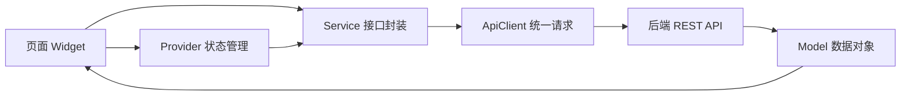
```mermaid
flowchart LR
    Widget[页面 Widget] --> Provider[Provider 状态管理]
    Widget --> Service[Service 接口封装]
    Provider --> Service
    Service --> ApiClient[ApiClient 统一请求]
    ApiClient --> Backend[后端 REST API]
    Backend --> Model[Model 数据对象]
    Model --> Widget
```

各页面职责如下：

| 页面 | 数据来源 | 展示内容 | 作用 |
|------|----------|----------|------|
| 首页 | `WordService.getDailyWords` | 今日新词、复习任务 | 让用户快速开始当天学习 |
| 排行榜 | `LeaderboardService` | 用户积分排名 | 增强闯关反馈和竞争感 |
| 个人中心 | `StudyService`、`UserProvider` | 学习统计、趋势、日历 | 展示长期学习情况 |
| 生词本 | `WordbookProvider`、`WordbookService` | 生词列表、AI 联想入口 | 管理难词和记忆内容 |

该设计的优点是数据来源清晰、页面逻辑较简单；缺点是分层后文件数量较多。实现难点集中在个人中心：该页面需要同时请求用户资料、统计、趋势、日历和生词信息，如果串行请求会导致整页等待。项目中通过并行请求和分块 loading 解决，基础统计先展示，趋势和日历加载完成后再局部刷新。


## 6.3 性能优化实践

前端优化重点放在个人中心多接口加载、页面可感知等待时间和生产环境请求稳定性上。以下数据来自 Chrome DevTools Network 面板和线上联调的多次手动记录，受 Railway 冷启动与网络状态影响会有波动，因此作为课程版本的工程基线，而不是严格压测结论。

| 优化项 | 优化前 | 优化后 | 效果说明 |
|--------|--------|--------|----------|
| 个人中心接口加载 | 用户资料、统计、趋势、日历、生词本等约 6 次请求串行等待，热启动环境总等待约 2.8s–3.4s | 改为用户资料 / 统计 / 趋势日历等 3 路并行，热启动环境首批统计约 1.1s–1.5s 展示 | 首屏可见统计提前约 1.5s–2.0s，用户不必等所有卡片加载完成 |
| Loading 展示 | 整页统一 loading，任一接口慢都会导致页面整体空白 | 分块 loading，基础统计先展示，趋势和日历后刷新 | 可感知等待时间从整页等待降低为局部等待 |
| 生词本数量 | 进入个人中心后额外请求生词本列表，仅用于统计数量 | 优先使用 `stats.wordbookWords` 与 Provider 缓存 | 减少 1 次非必要列表请求，降低弱网下的接口等待 |
| 生产 API 地址 | 前端曾请求局域网 HTTP 地址，线上浏览器触发 Mixed Content | 改为 Railway 后端 HTTPS `/api` 地址 | 登录、背词、闯关等线上流程恢复可用 |

该优化的优点是改动集中在前端数据加载和配置层，不改变后端接口协议；缺点是仍然存在多接口请求，后续可通过后端聚合接口进一步减少请求数量。

## 6.4 兼容性处理

Web 生产环境使用 HTTPS 后端地址；浅色与深色双主题 AppTheme；布局以移动端竖屏为主，适配 Flutter Web 与 Android。

# 七、后端实现 [陈子怡]

## 7.1 技术栈与架构

Spring Boot 3.5.11、Java 17、Maven；主类 com.zychen.backend.BackendApplication；分层 Controller → Service → Mapper。选择 Spring Boot 因 REST 与 JWT 生态成熟，团队熟悉 Java。

## 7.2 核心业务模块实现

### 7.2.1 用户认证与授权

AuthController、AuthServiceImpl 实现注册登录与 JWT 签发；JwtInterceptor 校验除白名单外的请求。认证模块采用“Controller 接收请求、Service 处理密码校验与 Token 签发、Interceptor 统一拦截鉴权”的设计，原因是登录逻辑和鉴权逻辑需要复用到所有业务接口，集中处理可以避免每个 Controller 重复校验。优点是接口层代码简洁、权限入口统一；缺点是需要维护白名单路径，新增公开接口时必须同步检查拦截器配置。

### 7.2.2 单词与学习服务

对应单词与学习：WordServiceImpl 实现每日单词筛选与学习提交，更新 user_word 与 study_record。学习状态单独保存在 `user_word` 中，而不是直接写入 `word` 表，原因是同一个单词会被多个用户学习，每个用户的掌握程度、复习次数和下次复习时间不同。优点是支持个性化学习进度和生词本状态；缺点是查询每日任务时需要关联用户学习状态，SQL 复杂度高于单表查询。

### 7.2.3 分级闯关业务逻辑

对应分级闯关：ChallengeServiceImpl 生成题目、结算得分、写入 battle_record、更新 user.total_score。闯关结算放在后端完成，而不是由前端直接提交分数，原因是题目答案、正确数量、积分变化都属于可信业务数据，必须由服务端统一计算。优点是能降低前端篡改分数的风险，并保证排行榜数据一致；缺点是后端需要保存并校验更多答题上下文。

### 7.2.4 数据统计分析

StudyServiceImpl 提供 stats、trend、calendar 聚合查询；LeaderboardServiceImpl 按 total_score 排序；WordbookServiceImpl 管理生词本与 AI 内容获取。统计接口按“总览、趋势、日历”拆分，原因是这些数据在页面上可分块展示，前端可以并行请求并局部刷新。优点是接口职责清晰、失败影响范围小；缺点是个人中心首屏可能产生多次请求，后续可以通过聚合接口进一步优化。

## 7.3 数据库设计

核心表：user（账号与积分）、word（词库 JSON 释义）、user_word（学习进度与复习计划，核心）、battle_record（闯关）、study_record（日统计）。关系：user 与 word 通过 user_word 多对多关联；user 一对多 battle_record、study_record。生词本无独立表，通过 `user_word.status = 2` 标识。本地与生产数据库结构主要基于 `init.sql`，Railway 生产环境通过 Railway MySQL 插件和环境变量配置数据库连接。

下图为数据库初始化后 `word` 词库表的部分数据截图，可以看到单词、JSON 格式释义、音标和创建时间等字段已成功写入，为每日背词、复习和闯关题目生成提供基础数据。

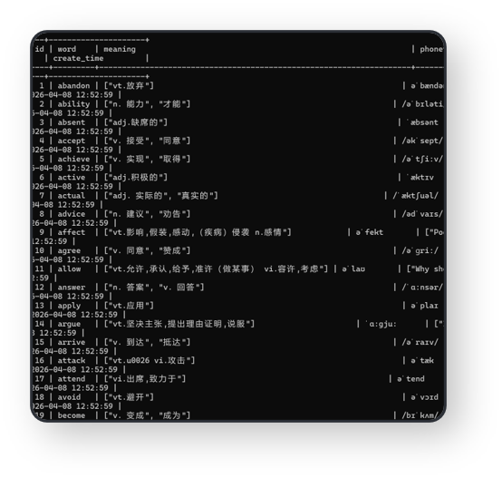

### ER 关系图

与 `init.sql` 最终表结构一致（`user_word` 的 `study_stage`、`today_mastered`、`last_study_time` 及 `user.email` 由 `ALTER TABLE` 追加）：

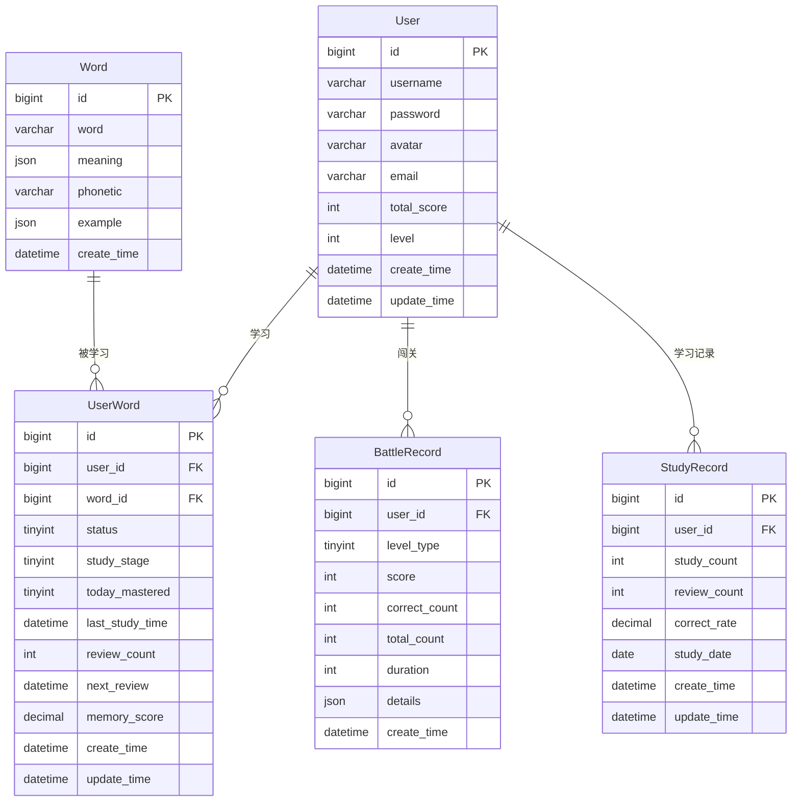
```mermaid
erDiagram
    User ||--o{ UserWord : 学习
    Word ||--o{ UserWord : 被学习
    User ||--o{ BattleRecord : 闯关
    User ||--o{ StudyRecord : 学习记录

    User {
        bigint id PK
        varchar username
        varchar password
        varchar avatar
        varchar email
        int total_score
        int level
        datetime create_time
        datetime update_time
    }

    Word {
        bigint id PK
        varchar word
        json meaning
        varchar phonetic
        json example
        datetime create_time
    }

    UserWord {
        bigint id PK
        bigint user_id FK
        bigint word_id FK
        tinyint status
        tinyint study_stage
        tinyint today_mastered
        datetime last_study_time
        int review_count
        datetime next_review
        decimal memory_score
        datetime create_time
        datetime update_time
    }

    BattleRecord {
        bigint id PK
        bigint user_id FK
        tinyint level_type
        int score
        int correct_count
        int total_count
        int duration
        json details
        datetime create_time
    }

    StudyRecord {
        bigint id PK
        bigint user_id FK
        int study_count
        int review_count
        decimal correct_rate
        date study_date
        datetime create_time
        datetime update_time
    }
```

**索引策略（节选）：** `user.uk_username`；`word.uk_word`；`user_word.uk_user_word`、`idx_review(user_id, status, next_review)`；`battle_record.idx_user_level`、`idx_time`；`study_record.uk_user_date`。完整 DDL 与说明见 `docs/database.md`。

## 7.4 中间件与工具集成

### 7.4.1 数据访问与状态存储

当前版本未部署独立缓存服务，学习状态、闯关记录、排行榜积分和生词本状态均持久化在 MySQL 中；后端通过 MyBatis Mapper 进行查询与更新。

### 7.4.2 日志系统（结构化日志）

logback-spring.xml 配合 logstash-logback-encoder 输出 JSON 行日志，字段含 time、level、message、module，Railway Logs 采集。

### 7.4.3 其他中间件集成

火山引擎 Ark SDK（AIServiceImpl）；Spring Boot Actuator（health、metrics）；Micrometer RequestMetricsFilter 统计请求数、耗时与错误。

## 7.5 性能优化实践

生产配置 MyBatis 下划线转驼峰，避免 word_id 映射失败导致 500；显式配置 XML Mapper 扫描路径，避免 learn 接口 SQL 未加载；排行榜查询使用索引字段排序。AI 服务对模型返回 JSON 做代码块包裹、尾逗号等容错解析，避免非标准输出直接导致接口失败。

# 八、AI 工程化应用 [张欣、陈子怡]

## 8.1 AI 辅助开发实践

- 使用了哪些 AI 工具（GitHub Copilot、Cursor、ChatGPT 等）：Cursor、Copilot、CodeRabbit
- 在哪些环节使用（代码生成、代码审查、文档编写、调试等）：页面代码、文档起草、PR Review、Mixed Content 等问题排查
- 实际效果和经验总结：加快编写速度，文档与代码需人工核对一致性

## 8.2 AI 辅助故障排查

- 问题描述：线上前端仍请求局域网 HTTP，浏览器 Mixed Content
- 提供给 AI 的上下文：Network 截图、api_constants.dart、Railway 部署说明
- AI 给出的分析和建议：改为 HTTPS 后端地址并重新构建 Frontend
- 实际解决结果：接口恢复正常，登录与背词流程可用

## 8.3 AI 功能集成  

本项目在生词本模块中集成了 AI 联想记忆功能，用于帮助用户从谐音、词根词缀、场景故事等角度理解和记忆单词。前端在用户点击生词本中的 AI 记忆入口后，调用 `GET /api/wordbook/ai/{wordId}` 获取联想记忆内容；后端 `AIServiceImpl` 根据单词、释义和提示词模板请求火山方舟大模型，并要求模型返回结构化 JSON。为避免模型输出格式不稳定，后端对代码块包裹、尾逗号、字段缺失等情况做了容错解析，再封装为 `AIMemoryContent` 返回前端。

安全方面，`ARK_API_KEY` 只通过 Railway Variables 或本地环境变量配置，不写入前端代码和仓库；用户输入和单词内容在进入 Prompt 前经过 `PromptInputSanitizer` 处理，降低 Prompt 注入和异常输入带来的风险。前端页面只负责展示后端返回的结构化内容，不直接拼接模型原始输出。

下图展示了 AI 联想记忆在移动端页面中的实际效果。页面顶部保留单词、音标和难度标签，下方按卡片展示“记忆锚点”“词根分解”“选择故事”等 AI 生成内容，用户可以在背词或复习时直接查看记忆提示。该设计的优点是把 AI 内容嵌入到原有学习流程中，不需要用户跳转到外部工具；缺点是模型调用依赖网络和第三方服务，响应速度与可用性会受云服务状态影响。

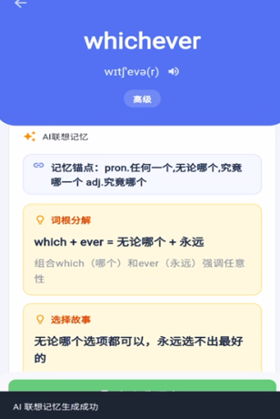

详见 `docs/ai-feature.md`。

> 本章开发实践、故障排查过程和 AI 功能说明由 AI 辅助整理，经团队成员结合实际开发记录、线上问题处理过程和 `docs/ai-feature.md` 人工审核修改。

# 九、安全设计 [张欣、陈子怡]

## 9.1 安全威胁分析

主要威胁：未授权 API 访问、SQL 注入、敏感信息泄露、CORS 滥用、弱密码。Flutter Web 无 DOM 直渲染用户 HTML，XSS 风险较低。

## 9.2 安全防护措施

### 9.2.1 身份认证与授权

JWT 无状态认证；除 /api/auth/register、/api/auth/login 外需 Bearer Token。

### 9.2.2 输入验证与 SQL 注入防护

Controller 参数校验；MyBatis #{} 绑定；AI PromptInputSanitizer。

### 9.2.3 敏感数据保护

密码 BCrypt；JWT_SECRET、数据库密码、ARK Key 仅 Railway Variables；前端日志脱敏；Railway 默认 HTTPS。

### 9.2.4 其他安全措施

JWT 无状态 API，未单独实现 CSRF（Bearer Token 不依赖 Cookie 会话）；当前未实现速率限制与安全 HTTP 头，仅依赖 JWT Bearer Token 和 CORS 白名单进行防护。

已实现：Dependabot 依赖更新；`docker.yml` 中 Trivy 镜像漏洞扫描；生产 CORS Origin 白名单；`security.yml` 中 Gitleaks 密钥扫描。

## 9.3 安全审计

`ci.yml` 执行 flutter analyze 与 Maven 测试；`security.yml` 执行 Gitleaks 密钥扫描；Docker 相关 workflow 集成 Trivy 镜像扫描；Dependabot 覆盖 GitHub Actions、Flutter Pub 与 Maven 依赖。详见 docs/security-review.md。

下图为 GitHub Actions 中 `Security Scan` 工作流的运行记录，可以看到该工作流已在多次提交和 PR 中自动执行并通过，用于验证仓库密钥扫描等安全检查是否通过。

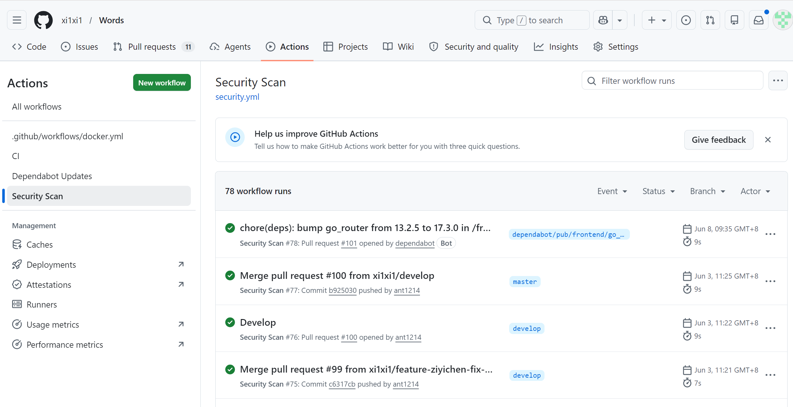

# 十、软件测试 [张欣、陈子怡]

## 10.1 测试策略

前端 flutter test；后端 JUnit + Spring Test；CI 工作流 `ci.yml`（analyze + test + Codecov）、`docker.yml`、`security.yml` 在 push/PR 时执行。

## 10.2 单元测试

前端 `frontend/test/` 当前包含 26 个测试文件，线覆盖率约 84.61%；后端 `backend/src/test/java/` 当前包含 21 个测试文件，共 117 个测试，覆盖 Controller、Service、Filter、JWT、AI 解析等路径，CI Overall Coverage 约 60.95%，本地 IDEA 统计约 70%。

## 10.3 集成测试

前端 Service mock HTTP；后端 Controller MockMvc 验证状态码与 JSON。

## 10.4 端到端测试情况

当前以手动联调与单元/集成测试为主，未引入 Playwright 全链路 E2E。

## 10.5 测试结果汇总

| 测试类型 | 用例数 | 通过率 | 覆盖率 |
|---------|--------|--------|--------|
| 前端单元/Widget/Service 测试 | 26 个测试文件 | CI 通过 | 84.61% |
| 后端单元/API 测试 | 117 个测试 / 21 个测试文件 | CI 通过 | CI 约 60.95%，本地约 70% |
| 集成测试 | Controller MockMvc、Service Mock API | CI 通过 | 随前后端覆盖率统计 |

测试结果由 GitHub Actions 自动执行并上传 Codecov，CI 流水线与覆盖率截图见第十一章。

> 本章测试策略、测试分类和结果汇总由 AI 辅助整理，经团队成员根据 `frontend/test/`、`backend/src/test/`、CI 结果和覆盖率数据人工核对修改。

# 十一、持续集成与持续交付（CI/CD） [张欣、陈子怡]

## 11.1 CI/CD 方案

GitHub Actions：`ci.yml`（analyze + test + Codecov）、`docker.yml`（GHCR 镜像构建 + Trivy 扫描）、`security.yml`（Gitleaks 密钥扫描）。

## 11.2 自动化流水线

前端：checkout → Flutter 3.35.7 → pub get → analyze → test --coverage → Codecov。后端：JDK 17 → Maven test → Codecov。Docker：路径变更触发 GHCR 镜像构建。

一次 push 后 GitHub 与 Railway 检查结果示例（6 项全部通过：Backend Java CI、Backend Lint、Frontend Flutter CI、Gitleaks 密钥扫描、前后端 Railway 自动部署）：

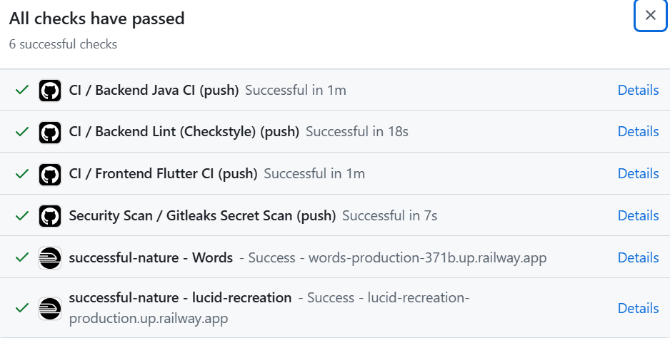

下图为项目 CI 与 Codecov 覆盖率徽章截图。徽章显示 CI 状态为 passing，覆盖率结果约为 65% 与 85%，说明测试结果已接入自动化流水线并上传覆盖率平台。


## 11.3 分支保护与质量门禁

PR 合并前需 CI 通过；CodeRabbit Review；Dependabot 每周检查依赖。项目在 PR 中接入 CodeRabbit 作为自动代码审查工具，用于辅助发现潜在代码问题、补充审查建议，并配合 CI 结果作为合并前的质量门禁参考。

下图为 CodeRabbit 在 PR 中的审查提示记录。由于该 PR 的目标分支不是默认分支，自动审查被跳过，但仍可通过 `@coderabbitai review` 手动触发审查，说明项目已集成 CodeRabbit 评论机器人并纳入 PR 协作流程。

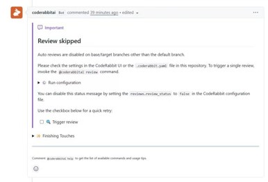

# 十二、系统部署 [陈子怡]

## 12.1 部署架构

用户浏览器 → Frontend（Nginx :8080）→ Backend（Spring Boot :8080）→ MySQL（Railway）。Frontend 与 Backend 分服务部署。

下图展示了 Railway 中前端服务、后端服务与 MySQL 数据库的部署状态。前后端作为独立 Web Service 部署，数据库通过 Railway MySQL 插件提供，符合本项目“前后端分离 + 云数据库”的部署方案。

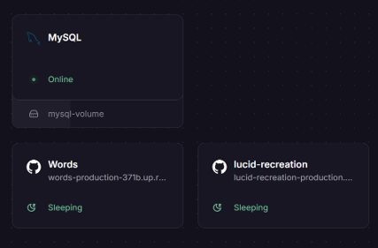

## 12.2 容器化方案

frontend/Dockerfile：flutter build web + Nginx；backend/Dockerfile：Maven 打包 + JRE 17；compose.yaml、compose.prod.yaml 本地编排。

## 12.3 部署步骤

本项目支持本地开发运行、Docker Compose 本地编排和 Railway 云端部署三种方式。三种方式使用的代码相同，但环境变量、数据库连接和启动命令不同。

### 12.3.1 本地开发运行

本地开发适合前后端联调和问题排查。开发者需要先准备 Java 17、Maven、Flutter SDK 和 MySQL 8.0，然后按以下步骤启动：

~~~ bash
# 1. 初始化数据库
mysql -u root -p < init.sql

# 2. 启动后端
cd backend
mvn spring-boot:run

# 3. 启动前端
cd ../frontend
flutter pub get
flutter run
~~~

本地运行时，前端 `api_constants.dart` 指向本机后端地址，后端通过本地配置连接 MySQL。该方式便于使用 IDE 调试 Controller、Service、Mapper 和 Flutter 页面。

### 12.3.2 Docker Compose 本地编排

Docker Compose 适合模拟部署环境。前端由 Nginx 托管 Flutter Web 构建产物，后端以 JAR 包方式运行，数据库由 Compose 中的 MySQL 服务提供。

~~~ bash
cp .env.example .env
docker compose -f compose.yaml --env-file .env up -d
~~~

启动后可通过前端页面验证注册、登录、背词、闯关和排行榜流程，也可以访问后端 `/health` 检查数据库连接状态。如果修改了环境变量或 Dockerfile，需要重新构建镜像并启动服务。

### 12.3.3 Railway 云端部署

Railway 部署用于课程最终演示。仓库连接 Railway 后，Frontend 和 Backend 分别配置为两个 Web Service，MySQL 使用 Railway 插件。master 分支更新后触发自动部署，Railway 提供 HTTPS 域名。

部署时主要配置项包括：Frontend Root Directory 为 `frontend`，Backend Root Directory 为 `backend`；数据库地址、用户名、密码、`JWT_SECRET`、`ARK_API_KEY` 等敏感信息写入 Railway Variables；生产前端 API 地址指向 Railway 后端 HTTPS `/api`。部署完成后，通过线上首页、后端 `/health` 和 Railway Logs 验证服务状态。

## 12.4 环境配置

开发：api_constants.dart 指向本机后端。生产：https://lucid-recreation-production.up.railway.app/api。敏感项 SPRING_DATASOURCE_*、JWT_SECRET、ARK_* 仅 Railway Variables。详见 docs/deployment.md。

# 十三、云服务应用 [陈子怡]

## 13.1 云平台选型

选用 Railway：支持 Docker、MySQL 插件、GitHub 自动部署、HTTPS 域名，与课程云服务作业一致。

## 13.2 使用的云服务

| 服务类型 | 具体产品 | 用途 |
|---------|---------|------|
| 计算 | Railway Web Service ×2 | Frontend + Backend |
| 数据库 | Railway MySQL | 业务数据 |
| 存储 | 未单独使用 | 当前镜像主要由 Railway 根据仓库 Dockerfile 构建，未单独使用对象存储或镜像仓库 |
| CDN | — | 未单独使用 |

## 13.3 成本与资源配置

使用 Railway 免费/试用额度；实例可能休眠导致冷启动；Frontend Root Directory 为 frontend，Backend 为 backend，master 分支自动部署。线上：https://words-production-371b.up.railway.app

# 十四、可观测性与监控 [张欣、陈子怡]

## 14.1 错误追踪

- 接入方式：未接入 Sentry
- 捕获了哪些类型的错误：通过 JSON 日志与 HTTP 状态码排查
- 是否配置了告警：未配置第三方告警，可依赖 Railway 与 /health 探活

## 14.2 日志管理

Logback + logstash-logback-encoder 输出 JSON；级别 root INFO；Railway Backend → Logs 查看。结构化日志便于按时间、级别、模块和 message 字段检索启动过程、接口异常和数据库连接状态。

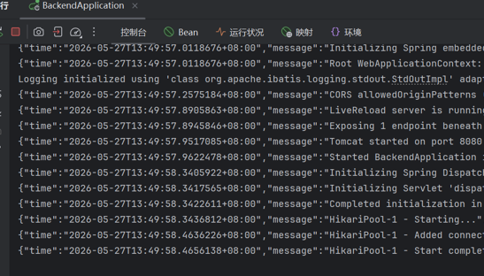

## 14.3 健康检查与可用性监控

后端 GET /health 返回 JSON（含 database 探针）；前端 Nginx GET /health 返回 healthy；Dockerfile HEALTHCHECK。未接入 UptimeRobot。

下图为后端 `/health` 健康检查接口返回结果，包含整体状态、版本、时间戳与数据库探针结果，可用于部署后快速验证后端服务与数据库连接是否正常。

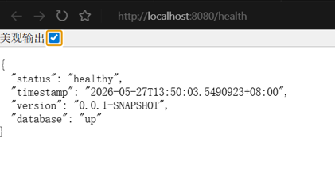

## 14.4 指标监控

Micrometer：beileme.http.requests、beileme.http.request.duration、beileme.http.errors；Actuator /actuator/metrics。详见 docs/monitoring.md。

# 十五、性能优化 [张欣、陈子怡]

## 15.1 性能基线报告

本项目使用 Chrome DevTools Lighthouse 对线上登录页 `https://words-production-371b.up.railway.app/#/login` 进行了 Web 性能检测。检测结果显示 Lighthouse 未能生成 Performance 总分，原因是报告中 `Largest Contentful Paint` 与 `Total Blocking Time` 均显示 `NO_LCP`。该结果不等同于性能 0 分，而是表示 Lighthouse 未能采集到完整的 LCP 数据；项目为 Flutter Web，首屏主要由 JavaScript/Flutter 渲染，可能导致 Lighthouse 对最大内容元素识别不稳定。

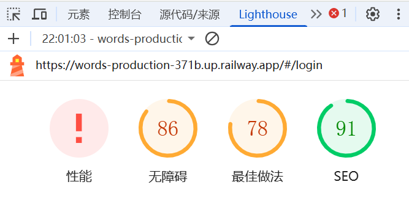

| 指标 | 检测结果 | 说明 |
|------|----------|------|
| Performance | 未生成分数 | LCP/TBT 显示 `NO_LCP`，因此 Lighthouse 未给出总分 |
| First Contentful Paint | 1.7s | 首次内容绘制较快 |
| Largest Contentful Paint | Error / NO_LCP | 未采集到最大内容绘制 |
| Total Blocking Time | Error / NO_LCP | 本次报告未生成该项有效值 |
| Cumulative Layout Shift | 0 | 页面布局稳定，无明显视觉位移 |
| Speed Index | 5.9s | 可视内容填充速度偏慢 |
| Accessibility | 86 | 无障碍表现较好 |
| Best Practices | 78 | 最佳实践仍有优化空间 |
| SEO | 91 | SEO 检测结果较好 |

除 Lighthouse 外，现阶段性能基线还来自可复现的工程验证与线上联调结果：

| 维度 | 当前基线 | 说明 |
|------|----------|------|
| 前端 Web 首屏 | 可正常加载并完成登录、首页、学习、闯关、排行榜、生词本等流程 | Lighthouse 显示 FCP 1.7s、Speed Index 5.9s，但 Performance 总分因 `NO_LCP` 未生成 |
| 前端交互 | 关键页面通过 Widget/Service 测试，线覆盖率 84.61% | 个人中心采用分块加载，避免所有数据返回前整页空白 |
| 后端接口 | 注册、登录、每日单词、学习提交、闯关、排行榜、AI 联想等接口已通过单元测试、MockMvc 测试与线上人工联调 | 后端 CI 覆盖率约 60.95%，本地 IDEA 覆盖率约 70% |
| 线上可用性 | Railway 前后端可访问；后端 `/health` 可返回数据库探针结果；前端 `/health` 返回 healthy | Railway 免费/试用实例存在冷启动，长时间未访问后首次请求可能明显变慢 |
| 后续补测计划 | 使用 Lighthouse 测 Web 指标；使用 JMeter/k6 测后端接口 P95/P99；使用 Flutter DevTools 测移动端帧率 | 当前课程版本以功能完整、部署可用和自动化测试为主 |

## 15.2 已完成的优化项

| 优化项 | 优化前 | 优化后 | 量化效果 / 说明 |
|--------|--------|--------|------------------|
| 个人中心请求 | 约 6 次请求串行等待，热启动环境总等待约 2.8s–3.4s | 3 路并行 + 分块 UI，首批统计约 1.1s–1.5s 展示 | 首屏统计提前约 1.5s–2.0s 展示，页面不再整页空白等待 |
| 生词本数量展示 | 需要额外请求生词本列表获取数量 | 优先复用 `stats.wordbookWords` 与 Provider 缓存 | 减少 1 次非必要列表请求，降低个人中心加载压力 |
| 生产 API | 局域网 HTTP，线上浏览器因 Mixed Content 阻止请求 | HTTPS 线上 API 地址 | 注册、登录、背词、闯关和排行榜流程恢复可用 |
| MyBatis 生产配置 | 生产环境字段映射缺省，部分接口出现 500 | Railway Variables 显式配置下划线转驼峰和 XML Mapper 路径 | `learn`、统计等接口在生产环境稳定返回 |
| Nginx 静态缓存 | 静态资源未单独配置缓存策略 | 对 Flutter Web 静态资源设置 7 天 cache | 重复访问时可复用浏览器缓存，减少静态资源重复下载 |

# 十六、功能展示 [张欣、陈子怡]

## 16.1 系统演示

在线地址：https://words-production-371b.up.railway.app。演示路径：注册登录 → 首页学习 → 闯关 → 排行榜 → 生词本 AI → 个人中心。功能演示视频位于 [report-images/test.mp4](report-images/test.mp4)，视频内容围绕已实现功能展开，避免依赖外部说明材料。

为减少文档篇幅，功能展示按模块组织，每组截图对应一个主要业务流程：

| 模块 | 展示页面 | 说明 |
|------|----------|------|
| 认证与首页 | 登录、注册、首页 | 展示用户进入系统、完成登录注册和查看今日学习任务的流程 |
| 背词与复习 | 学习页、单词详情页 | 展示标准背词、复习和 AI 联想记忆入口 |
| 闯关与排行 | 闯关页、排行榜页 | 展示分级闯关、得分反馈和全服积分排名 |
| 个人中心 | 我的、生词本、设置 | 展示学习统计、生词管理、深色模式和个人设置 |


## 16.2 性能测试结果

前端单元测试覆盖率 84.61%；后端 CI 覆盖率约 60.95%；CI 检查通过。个人中心分块加载较整页 loading 体验明显提升；线上接口在 Railway 冷启动后响应较慢，热启动状态下注册、登录、背词、闯关、排行榜和 AI 流程可完成演示。

# 十七、总结与展望 [张欣、陈子怡]

## 17.1 项目总结

完成背词、闯关、排行榜、生词本与 AI 等核心功能；前后端分离；本地、Docker、Railway 均可运行；文档与 CI 齐全。

## 17.2 技术收获

张欣：Flutter 工程化、Provider、go_router、ApiClient 联调、单词学习交互、AI 展示、Docker/CI、分块加载。陈子怡：Spring Boot 分层、MyBatis、JWT、数据库建模、AI 后端封装、云部署、安全加固与监控。

## 17.3 问题与反思

主要问题包括：Mixed Content 导致线上前端请求失败，通过改为 Railway HTTPS baseUrl 解决；生产库 JDBC 与 MyBatis 配置缺失导致 500，通过 Railway Variables 显式配置；CORS 跨域失败，通过白名单 Origin 解决；AI 返回非标准 JSON，通过后端容错解析与 DTO 封装解决；个人中心串行请求体验慢，通过并行请求与分块 loading 优化。

## 17.4 未来展望

后续计划：合并部分统计接口减少前端请求数；接入 Redis 缓存排行榜和 AI 结果；增加 PWA 离线能力；补充 Playwright 或 Flutter Driver 端到端自动化测试；增加速率限制、安全 HTTP 头和第三方告警，提高接口防护与线上可用性。实时对战、消息推送、独立离线词库管理页尚未在当前版本实现，后续如果继续迭代，可作为功能扩展方向。

# 参考文献

[1] Flutter 官方文档. https://docs.flutter.dev/

[2] Spring Boot 官方文档. https://spring.io/projects/spring-boot

[3] MyBatis 官方文档. https://mybatis.org/mybatis-3/

[4] JSON Web Token (JWT). https://jwt.io/introduction

[5] 火山引擎方舟大模型服务文档. https://www.volcengine.com/docs/

[6] Railway 部署文档. https://docs.railway.app/

# AI 使用声明

本文档中以下部分由 AI 辅助生成，经人工审核和修改：

| 章节 | AI 工具 | 使用方式 | 人工修改情况 |
|------|---------|---------|-------------|
| 全文框架与部分章节 | Cursor | 按 sample_docs 模板生成 | 核对代码、接口、分工 |
| 第五章 API 设计 | Cursor | 生成接口描述 | 逐条核对 docs/api.md |
| 第八章 AI 工程化应用 | Cursor / ChatGPT | 整理 AI 开发与故障排查过程 | 对照 contributions 与实际代码修订 |
| 第十章 软件测试 | Cursor | 辅助生成测试用例与覆盖率说明 | 按实际测试文件、覆盖率和 CI 结果核对 |

未在上表中列出的章节均由团队成员根据实际实现撰写或核对。其他章节中的部分文字润色、表格整理和图片说明也使用 AI 辅助完成，均由团队成员根据实际代码、测试和部署结果人工核对。

# 第三方库与开源引用

本项目使用的第三方库及开源代码清单：

| 库 / 框架 | 版本 | 用途 | 来源 |
|-----------|------|------|------|
| Flutter / Dart | Flutter 3.x / Dart SDK ^3.9.2 | 前端 UI | https://flutter.dev |
| provider | ^6.1.1 | 状态管理 | https://pub.dev/packages/provider |
| go_router | ^13.0.0 | 路由 | https://pub.dev/packages/go_router |
| http | ^1.2.1 | HTTP 客户端 | https://pub.dev/packages/http |
| shared_preferences | ^2.2.2 | 本地存储 | https://pub.dev/packages/shared_preferences |
| Spring Boot | 3.5.11 | 后端框架 | https://spring.io/projects/spring-boot |
| MyBatis Spring Boot Starter | 3.0.5 | SQL 映射 | https://mybatis.org |
| jjwt | 0.11.5 | JWT 生成与解析 | https://github.com/jwtk/jjwt |
| okhttp | 4.12.0 | 后端调用 Ark HTTP 接口 | https://square.github.io/okhttp/ |
| logstash-logback-encoder | 8.0 | JSON 日志 | https://github.com/logfellow/logstash-logback-encoder |

> 以上第三方库均通过 pub.dev / Maven 引入，未直接复制源码。

# 项目结构

以下为本仓库实际主要目录布局，便于快速定位代码、测试、文档、部署和 CI/CD 配置文件：

~~~ text
Words/
├── README.md                       # 项目说明
├── AGENTS.md / CLAUDE.md            # AI 协作与项目约定说明
├── .env.example                     # 环境变量示例
├── init.sql                         # 数据库初始化脚本
├── docker-compose.yml               # 早期/兼容 Docker Compose 配置
├── compose.yaml                     # 本地开发编排配置
├── compose.prod.yaml                # 生产环境编排配置
├── deploy.sh                        # 部署辅助脚本
│
├── .github/
│   ├── dependabot.yml               # 依赖自动更新配置
│   └── workflows/                   # GitHub Actions 工作流
│       ├── ci.yml                   # 前后端测试、分析与覆盖率上传
│       ├── test.yml                 # 测试相关工作流
│       ├── docker.yml               # 后端/整体 Docker 镜像构建与扫描
│       ├── frontend-docker.yml      # 前端 Docker 镜像构建
│       └── security.yml             # Gitleaks 等安全扫描
│
├── docs/                            # 项目文档
│   ├── project-document.md          # 本报告源文件（Markdown）
│   ├── sample_docs.md               # 报告模板参考
│   ├── api.md / api.yaml            # API 文档
│   ├── backend.md                   # 后端说明
│   ├── deployment.md                # 部署说明
│   ├── monitoring.md                # 监控说明
│   ├── security-review.md           # 安全审计说明
│   ├── frontend-defense-guide.md    # 前端答辩说明
│   ├── contributions/               # 团队成员贡献记录
│   ├── design/screenshots/          # 设计截图占位目录
│   └── report-images/               # 报告图片与截图
│
├── frontend/                        # Flutter 前端项目
│   ├── pubspec.yaml                 # Flutter 依赖配置
│   ├── analysis_options.yaml         # Dart/Flutter 静态检查配置
│   ├── Dockerfile                   # 前端容器构建配置
│   ├── nginx.conf                   # Flutter Web Nginx 配置
│   ├── lib/
│   │   ├── main.dart / app.dart      # 应用入口与路由挂载
│   │   ├── core/                    # 常量、网络、Provider、主题
│   │   ├── features/                # auth、home、study、challenge 等页面模块
│   │   ├── services/                # API 服务封装
│   │   ├── models/                  # 前端数据模型
│   │   └── widgets/                 # 通用组件
│   ├── test/                        # Flutter 单元、Widget、Service 测试
│   ├── web/                         # Web 入口文件
│   ├── android/                     # Android 平台工程
│   ├── ios/                         # iOS 平台工程
│   ├── linux/                       # Linux 桌面平台工程
│   ├── macos/                       # macOS 桌面平台工程
│   └── windows/                     # Windows 桌面平台工程
│
└── backend/                         # Spring Boot 后端项目
    ├── pom.xml                      # Maven 依赖与构建配置
    ├── mvnw / mvnw.cmd              # Maven Wrapper
    ├── Dockerfile                   # 后端容器构建配置
    ├── src/main/java/com/zychen/backend/
    │   ├── BackendApplication.java   # Spring Boot 启动类
    │   ├── common/                  # 通用异常、全局异常处理、输入清洗
    │   ├── config/                  # JWT、Web、指标、请求过滤器配置
    │   ├── controller/              # REST API 控制器
    │   ├── dto/                     # 请求与响应 DTO
    │   ├── entity/                  # 数据库实体
    │   ├── mapper/                  # MyBatis Mapper 接口与查询结果对象
    │   └── service/                 # 业务接口与实现
    ├── src/main/resources/
    │   ├── mapper/                  # MyBatis XML Mapper
    │   └── logback-spring.xml       # 结构化日志配置
    └── src/test/                    # JUnit、MockMvc、Service、Filter 等测试
~~~
